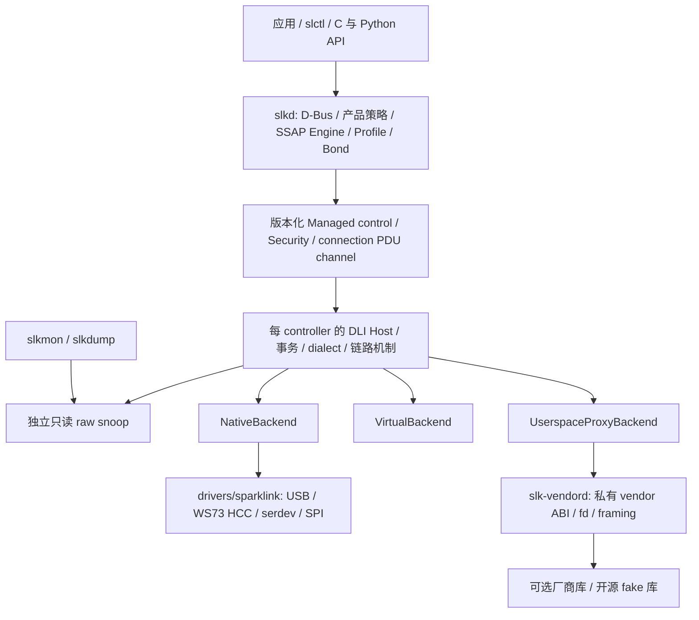
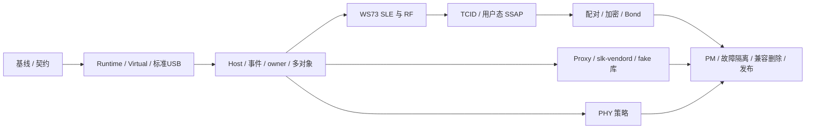

# SparkLink / Linux 联合实施方案

规划基线：2026-10-09。覆盖 Linux #1–#19、sparklink #1–#7 的全部现有范围；逐项验收仍以各 issue 的原始 checklist 为准。本文件描述目标设计和执行顺序，不能作为功能已经完成的证明。

Linux 主跟踪：[厂商框架与 WS73 #8](https://github.com/OpenSparklink/linux/issues/8)。联合跟踪：[跟踪：Linux 与用户态 SparkLink 全部 issues 的联合实施和验收](https://github.com/OpenSparklink/sparklink/issues/8)。本文中的 `K#n` 指 OpenSparklink/linux，`U#n` 指 OpenSparklink/sparklink。

## 第一北极星与优先交付路径（2026-10-10）

**普通用户通过 slctl 选择两只真实 WS73，让一只广播、另一只发现它；
交换角色和拔插后仍能重复成功。** 两只独立 Ready，每轮随机标识，
10 秒内显示匹配数据/地址/RSSI；交换角色连续 20 轮；单设备拔出不影响
另一只，重插无需重启 slkd；应用无需 sudo，并留存可复现测试和真实空口
证据。详细定义与阴性对照见 [北极星验收](WS73_DISCOVERY_NORTH_STAR.md)，
联合里程碑为 [U#10](https://github.com/OpenSparklink/sparklink/issues/10)。

按 **最小每设备 Runtime → WS73 启动/HCC/BSLE → 真实 DLI 查询 →
广播/扫描 → 内核事件 → 动态 adapter/slctl** 推进 S1–S3 相关纵向路径。
Virtual 作为开发支撑，不能替代真实双设备验收。之后扩展四设备两组并行。
完整 S0–S6、原 issue checklist 和 CI/安全门禁均保留；SSAP/配对策略等
后续完整功能不作为此第一条广播/发现路径的前置依赖。部分成果不关闭整项 issue。

最小 Runtime 已持稳定 `Arc<ControllerRuntime>`、每设备协议锁、IRQ RX 环
及 RX/TX work；USB context 携带注册 generation，probe 失败撤销 owner/URB。
标准 DLI parser/fixture 已补齐 command-credit 与五字节版本；旧 fixture
结果仍保留，但不证明完整标准符合性。

所有 runtime USB typed/raw 命令现共用每设备有界 Host 队列和 credit；单个
在途命令等待匹配 Status/Complete，管理回复单独保留，raw 结果按已发送的
sequence 解析。广播/扫描的旧 enable/disable 回复不确认较新的 intent。
修正 pending sentinel 被误判为 resolved、导致 GC 删除未完成条目的问题；
回复超时/传输失败停发该设备，不猜测恢复 credit。该层仍不是完整 Host：
bootstrap credit waiter、异步 terminal correlation、Ready/fault 发布、恢复
以及 typed 参数/数据完整事务仍未完成。

上一轮 image #33 无警告构建；两虚拟设备同时各 12 次 MAC 查询并混合 internal /
raw Reset，逐条地址匹配，raw submitted/resolved 恰好各 +13、pending=0、无
新增 timeout；随后单次拔插/索引复用 gate PASS。完整回归的精确命令归属单项
亦 PASS；完整 96 项、21 条失败断言、0 skip、strict FAIL，仍有残留连接、
异步完成关联与压力/背压失败，另有 printk 打断 marker。旧失败不覆盖、不删
断言；内核未提交。这些均不证明真实 WS73、slkd/no-sudo、20 轮、四设备或
全部生命周期条件。后续补全广播/扫描的确认与参数/数据事务、Ready/fault
和 WS73 原生 DLI 接口，继续纵向路径；完整连接/SSAP/security policy
原范围保留，不扩大为第一北极星前置依赖。
原生 WS73 工作树已实现 per-interface USB/HCC/BSLE 启动序列及严格 aggregate
解析，读取外部 board customization/PM 两份 raw 配置；完成仅为
`sle-awaiting-dli`，尚未注册 Ready 或打通原生 DLI。生产 codec/sequencer
合成测试 3,198 checks 与主机 ASan/UBSan/LSan PASS，lab/verifier 共 57 项
PASS。新 image #34 的完整回归暴露原连接注入的空 slice panic，已修复并
加空/超长帧拒绝回归；最终 #35 两条断言、fuzz、精确 command 单项和独立
虚拟 Runtime 拔插 PASS。完整 96 项仍 24 条失败断言、strict FAIL；两条
三设备子路径未执行，不作全分支覆盖。本轮主机 WS73=[]，真实北极星未验收。
下一步先核验 SDK board 配置，继续 WS73 原生 DLI/Runtime 接入，再完成
广播/扫描确认、内核事件和动态 adapter/slctl。全部原范围和门禁保留。

完整记录和证据边界见 [Runtime 开发记录](WS73_DISCOVERY_NORTH_STAR.md#runtime-第一阶段开发记录2026-10-10)。

## 基线与当前证据

| 项目 | 已核验状态 | 证据边界 |
|---|---|---|
| Linux 源码 | `e9aac11ff601da9cf9d50d0916262a285c7e9b81` + 未提交 WS73 boot / lab / Runtime 第一阶段 | 稳定每设备 Arc/协议锁/RX 环/worker，Deref 桥已移除；仍有静态 Backend enum、generation-tagged USB RX、统一 USB command Host 队列；bootstrap/terminal/Ready/fault/恢复未完整和内核 SSAP 数据库 |
| 用户态源码 | 功能分支 `codex/sparklink-ws73`，代码提交至 `7adb796`（见交付记录） | 事件等待已移到独立任务；对象仍固定 slk0；Bond 不含可恢复凭据；没有 slk-vendord |
| 参考实现 | libws73-usb `f4d85d0e95af2d0043432e1301fd2f6b660a4906` | 参考源码及作者 capture 只作协议证据，另列来源，不能冒充本项目实测 |
| 新增 Host 参考 | OpenHarmony communication_nearlink_service `f0872dfaac33ffa99b80b352f6c05fba2df6414e` | 已检查分层、DLI/TCID/SSAP/安全与 HAL/桩边界；未构建/运行，不作为实测。调整见下节 |
| WS73 boot / native transport | HCC/BSLE 新实现尚未实机验收；旧 run `ws73-run-20261009-225342`：四设备分别下载三镜像，重新枚举到 runtime，4/4 同时绑定 | 旧 run 逐个启动；并发固件上传曾失败。新 HCC/BSLE 合成测试不验证真实 SLE；DLI/Ready/RF/PM 仍未完成。旧 run 未保存完整 artifact/firmware hash，不追补伪造绑定 |
| 本轮硬件环境 | 2026-10-09T18:59:24Z 主机只读检查：WS73 inventory 为空；隔离环境设备节点隐藏，但最新提权只读检查确认 KVM 可读写、USB nodes 存在 | 自定义 QEMU guest 已能运行；真实 WS73/RF gate 未验收。每次实机运行前重新核验，不能把隔离视图当作主机权限结论 |
| 初始自测缺陷 | C selftest 无条件返回 0、runner 可降级 USB 模型后 PASS，已在工作树修复 | 25 项判定器测试通过；实际 guest 回归尚未运行，历史 PASS 不作新架构证据 |
| 初始 ABI 漂移 | Python `SleConnInfo` 56B→64B；用户态 `SleDliInfo` 两字段 u8→u16，已修复 | C/Rust/Python 11 个结构、100 字段 conformance 与写入回归通过；完整 ABI/32 位/真实调用仍待验收 |
| 软件测试 | Python 23/23、Rust workspace 135/135（含真实私有 D-Bus 静默 30s、存储与 Profile 阻塞/取消/drain/panic、Unicode 输入）；判定器 25/25；lab 16/16 | 全仓 fmt、除 slkd 外六 crate 的 all-targets 严格 clippy 通过；Bond I/O 与连接 Profile callback 已移出业务锁；slkd 未接通的策略/SSAP/transport 与旧接口 lint 仍未通过严格 CI，尚未满足完整 CI 或硬件验收 |

## 目标架构与所有权

### NearLink Host 参考纳入（2026-10-10）

用户提供 `communication_nearlink_service` 后，增加固定 revision 的 Host 参考
复核。完整来源表及决定见本地 `docs/NEARLINK_HOST_REFERENCE.md`。
S0 加入协议差异与来源清单；S1/S2 明确 standard DLI / WS73 / reference profile；
S4 先交付本地 SSAP V1.2.0，参考中的 1.3 fragment/multiProcessing 扩展需单独
核验和 feature gate；S5 检查安全方法、lcid 与失败路径；S6 增加独立差分 harness。
参考的 0x0401=SetEventMask 与本地新版 DLI 冲突，不能机械复用。真实 OpenHarmony
HAL 依赖外部 HDI，local test 桩模拟回复；未完成参考构建/运行前不报差分 PASS。
每 controller 所有权、Linux 内核机制 / slkd SSAP 与 policy 分层、WS73 优先级及
全部原验收 checklist 保持不变，不引入无关联 issue 的音频/测距产品范围。

| 层 | 拥有的内容 | 接口约束 |
|---|---|---|
| `net/sparklink` | 每 controller 的 Host、标准及显式 WS73 dialect、pending、连接/TCID、低层分片/credit、安全机制、PHY 合法性与原子应用 | Backend 只收发完整 DLI wire packet，不决定标准 opcode、SSAP 或 policy；dialect 编解码由 Host 完成 |
| `drivers/sparklink` | bus match、固件、端点、HCC/BSLE、URB、内部 DliChannel、power/recover | register/unregister + start/send/stop/recover + RX/fault/hangup；硬件差异不进入应用 API |
| `slkd` | 唯一 Managed writer；启用策略、Agent/trust、持久化 Bond、SSAP codec/session/MTU/数据库、Profile、PHY policy | 每 controller/connection 独立状态；应用写操作通过 D-Bus 授权；不加载厂商库 |
| `slk-vendord` | 独占 Proxy lease；受控库映射、typed vendor lifecycle、vendor fd、framing | 和 slkd 分进程；厂商 `op(int, void*)` 只存在内部；崩溃只影响对应 controller |
| 工具 / 绑定 | 独立只读状态和 snoop；普通控制经 slkd | raw Diagnostic 是受权独占模式；不与 Managed writer 并行改硬件 |

源码注册、产品启用、Backend present、Controller Ready 是四个独立事实。安装驱动或库、进程启动、USB runtime 枚举均不表示 Ready。能力和限制包含来源与 known/unknown；未确认不能默认支持。WS73 先支持 USB NativeBackend，闭源厂商路径按独立 Proxy 方案并行推进。

## 标准基线与章节映射

用户提供的本地标准归档已定位为相邻目录 `../sparklink-standards`；其 `00_标准清单.csv` 记录版本和 hash。本方案使用该归档的版本，不宣称它们是联盟当前最新版本。标准正文、测试规范、故事图解分开；故事图解只作辅助。源码现有注释与常量必须重新和正文/表格核对。

| 归档标准 | 重点章节 | 实现与验收归属 |
|---|---|---|
| T/XS 00001-2025 V2.0.0 架构 | §6–§9 | 分层/传输通道与功能归属；K#1/#6，U#3 |
| T/XS 10003-2025 V1.1.0 数据连接接口 | §6–§9；§10 测试；附录 B/C/D | 标准 transport/packet/opcode/event/错误码；K#2/#11/#13/#16/#19 |
| T/XS 10002-2025 V2.1.1 SLE | §7、§9、§11/§13；加解密示例附录 F | 链路机制与安全/测试向量；K#7/#18/#19，U#5 |
| T/XS 20001-2025 V1.2.0 设备发现与服务管理 | §6、§7.2–§7.4、UUID 附录 B | 广播/SSAP Engine、权限、协商、事务、Profile；K#2/#6，U#3 |
| T/XS 20002-2025 V1.1.2 传输与控制规范 | §6–§8 | TCID、传输模式/帧/分片、连接能力与测量；K#6/#17，U#3/#4 |
| T/XS 40001-2022 V1.0.0 网络安全通用要求 | §6–§9 | 安全/授权/凭据/日志；K#5/#7，U#5/#7 |
| T/XS 30011-2025 V1.1.0 电量信息管理 | §7、附录 A | 正确 Battery service/attribute/权限；U#3 |
| T/XS 30004-2025 V1.1.0 HID 数据交互；30013-2025 V1.1.0 HID 应用配置 | 30004 §7–§10/附录 A；30013 §6–§9 | HID+DeviceInfo 服务、描述符/权限、数据路径；U#3 |
| T/XS 30012-2025 V1.1.0 设备信息管理 | 正文/UUID 表，实施前逐项核对 | HID 的必选服务依赖；U#3 |
| T/XS 50003-2025 V1.2.0 SLE 设备测试 | §4 的 mandatory/conditional 特性矩阵 | 按实际角色/能力选择测试；K#19 |
| T/XS 50004-2025 V1.2.0 基础服务层测试 | §6–§11；数据集附录 | discovery/connection/SSAP/data 与异常；K#6/#17/#19，U#3 |
| T/XS 50005-2025 V1.0.0 电量信息服务测试 | §6–§9；数据集附录 | Battery discovery/read/descriptor/notify/indicate；U#3 |

已核对的设计约束：标准 TCID 是按 peer 独立的一字节标识，local/remote TCID 可不同；WS73 envelope 的 LE16 表示只属于方言适配。默认 SMTC 使用基础模式，可靠 SSAP 需分别协商连接与 SSAP 能力后建立可靠通道。SSAP、底层流/可靠 SDU、USB/HCC/ACB 三层分片独立；默认基础模式不能借任意底层切分替代 SSAP 分片。

SSAP Engine 先 ExchangeInfo，再使用协商 MTU/扩展码/分片/事务号/可靠能力；未协商事务号时，每 peer/channel 的 request-response 与 indication-ack 各自单在途，双向交互按标准 30s 失败门禁；command/notify 不受该等待阻塞。分片 timer、丢片/断链、属性修改的不确定状态按正文错误语义测试。

当前 Battery 使用 Bluetooth 的 `0x180F/0x2A19`，须按星闪标准改为 `0x060A/0x1034` 并验证描述符/权限/通知；DeviceInfo 的旧 `0x180A` 须重新核对 30012。HID 不能仅靠 callback unit test 宣告符合，需完成应用配置及必选 DeviceInfo 依赖。标准没有规定 SSAP 必须在哪个 OS 层，迁入 slkd 是本项目的明确架构选择。

每条验收增加 `标准号/版本/hash → 章/表/规范用例 id → 角色与 mandatory/conditional 判定 → 实现 → golden/负向测试 → 实机证据`。标准内部疑似勘误单列（例如 DLI §7.2 表 7 的范围与分组规则），结合具体命令表/实际 wire 核对，不盲抄；固件不支持或偏离标准的能力显式报告，不能由 Host 伪造符合性。完整正文 PDF 保持本地归档，不附到公共 issues。

### Controller runtime 与生命周期

每个对象拥有：稳定 controller id、递增 generation、parent device、可引用 Backend handle、descriptor、Host/codec/pending、RX/TX 有界队列与 worker、连接和安全状态、订阅者。注册表只索引可引用对象，不负责切换全局协议状态。相同 peer 地址也按 controller 分区。

生命周期为 `Registered → Starting → Initializing → Ready → Enabled`，另有 `Suspended / Recovering / Fault / Removing / Dead`。Ready 必须包含 Backend channel 可用、初始化通知及 Host 真实查询成功；Enabled 由产品/管理策略决定。停止先禁止提交、使旧 generation 失效，再在锁外停止 Backend、取消/drain worker 和 pending，最后撤销对象。注销返回后不得再访问释放对象。

URB/serdev 原子回调只执行受界限的拷贝/排队与调度；协议解析和可睡眠操作在 per-device worker。全局/registry 锁不覆盖 USB I/O、用户态等待或同步取消。异步结果附 controller/generation，过期结果丢弃并计数。模块/FFI 所有权保证 callback 存活；外部接口最多提供小型版本化 C seam，不承诺稳定 Rust ABI 或任意模块组合。

### Host transaction 与事件

Host 提供 typed 广播、扫描、连接事务，编码完整参数和顺序，处理 Status、Complete 与领域完成事件。发送成功只表示提交成功。命令响应只完成原 requester；状态 fan-out 给所有独立订阅者；raw TX/RX snoop 保留独立队列、序号及 overflow 计数。事件携带 controller、generation、类型和本地 request cookie。

本地 cookie 不会被固件自动回传。无 wire transaction id 时限制在途请求；同 opcode 超时后不能把迟到回复关联给新请求。使用保守排队/隔离或 reset generation，并通过故障注入证明。高流量和慢 snoop 不能阻塞状态更新；每路 overflow 明确可见；poll/epoll 由事件到达唤醒，主路径移除 50ms 补偿轮询。

### UAPI、权限与兼容

以 Linux `include/uapi/linux/sparklink{,_ioctl}.h` 为 ABI 规范来源；新接口包含固定宽度 version/size/flags/reserved、长度/队列上限、controller/generation/sequence。C、Rust、Python 比较同一字段的 size、align、offset、enum 和 ioctl 编号，覆盖成功打开和真实调用；布局测试不只比较复制的常量。结构升级采用新版本/编号或协商，禁止静默改旧布局。

三个 owner 相互独立：slkd Managed writer、slk-vendord BackendProxy owner、用户态 per-connection PDU owner。重复 owner、错误 id/lease/generation、非法状态/长度均拒绝。只读订阅与 owner 分开；Diagnostic raw 需 CAP_NET_ADMIN 并独占，进入前停止 Managed writer 的冲突活动。configfs 仅启动配置；debugfs 仅诊断；genl 与 ioctl 不再形成多个无协调写入口。32/64 位兼容、保留字段与旧 API 的弃用窗口纳入 conformance。

Proxy v1 使用有界 `read/write/poll`，包括 REGISTER、START/STOP/RESET/RECOVER、READY/FAILED/FAULT/HANGUP/UNREGISTER 与完整 packet。fd-close 自动 detach，旧 lease/generation 不能重新注入。READY 是初始化事实声明，Host 仍真实查询验证。先测复制/切换成本，再决定是否引入可协商 mmap ring，不让共享内存成为 v1 前提。

### SSAP、安全与 PHY

内核 connection channel 定位 controller/generation/connection/peer/local+remote TCID，提供完整 SSAP PDU、顺序、bounded queue、断链和安全上下文；不拥有服务数据库。slkd Engine 拥有 codec、MTU、SSAP 分片、协商后事务、超时、remote cache、handle 分配与 Profile callback。Profile request context 包含请求 id、连接、attribute/op/offset/payload/security/deadline；read/write/method/notify/indication+ack 经真实 PDU 路由。属性/描述符的读写、认证、加密和授权分别校验。

内核保留配对时序、密码学、active credential、加密安装和强制机制；slkd 决定方法、MITM、接受/拒绝、Agent/passkey/OOB/PSK 和 trust。没有 owner、拒绝、超时或 owner 崩溃均 fail closed。Bond 采用可恢复的 wrapped credential baseline，按 controller+peer 持久化，原子写入、安全目录、0600、格式版本及敏感缓冲清理；仅有 fingerprint 不合格。opaque token 只在明确 capability 时启用。revoke 同时撤销持久存储、内核/RAL 与可选 token。默认 D-Bus 可读，写入需 root/polkit 或等价授权。

PHY mechanism 校验 runtime capability、法规和参数并报告实际结果；slkd 提供 Fixed/Balanced/Throughput/LowPower 策略、hysteresis、minimum dwell、failure backoff 和公平调度。配置目标与 actual state 分开，未知能力不会触发自动切换。

## 执行顺序与阶段门禁

issue 间的依赖分为“接口契约可协作设计”和“最终验收必须等待”。K#4 与 K#9 不互相等待整项关闭：先共同固定 controller ownership contract，再迁移、联调、分别验收。所有阶段可提前开发 pure codec、fixtures、fake 和文档；不得用 fake 结果替代实机。

| 阶段 | 主要工作与 issue | 退出条件 |
|---|---|---|
| **S0：可信基线** | K#1/#5/#13/#19、U#1：修 selftest verdict / ABI 漂移 / 同步 fd 的 Tokio 依赖；清理 fmt/clippy 与严格 CI 基线；冻结源码、toolchain、config；Host/Backend/owner ADR 和 WS73 证据矩阵 | 故意失败不能 PASS；C/Rust/Python conformance 通过；30s 静默事件期间并发 D-Bus 响应和 shutdown 正常；严格质量检查及现有基线失败明确 |
| **S1：每设备骨架** | K#4/#9/#10/#11/#12：可注册 runtime、descriptor、引用/模块所有权、generation；先实现真实 VirtualBackend，再迁标准 USB | 两 controller 交错同 opcode、inactive RX、不串状态；register 不冒充 Ready；失败/注销无 UAF/睡眠原子上下文；无 USB 的 core+Virtual 可构建 |
| **S2：公共 Host 与控制面** | K#2/#3/#5；U#2/#6：typed transaction、统一事件/snoop、Managed owner、动态 adapter 对象和枚举快照 | Virtual 和标准 QEMU USB 同一事务通过；迟到/重复/丢失事件与多 reader 负向通过；无锁内 I/O；独立 Enabled/Available/Powered 可观察 |
| **S3：优先完成 WS73 RF** | K#13/#14/#15/#16：USB/HCC/BSLE、固件/取消、Host dialect、真实版本/buffer、广播扫描建链断链 | G0 boot → G1 SLE/真实 DLI → G2 RF；标准 codec 不受影响；四设备独立 Ready，失败阶段明确；TX/RX capture 可复现 |
| **S4：真实数据与用户态 SSAP** | K#6/#17；U#3：TCID/ACB/credit、PDU owner、用户态 Engine/Profile、工具/绑定迁移 | G3 两组双向数据、长 PDU/253–255B 边界、真实远端 Profile callback/read/write/notify/indication；daemon crash、满队列、断链有确定结果 |
| **S5：安全、策略与 Proxy** | K#7/#18 与 U#5；U#4；K#1/#5 与 U#7 独立分支 | G4 实机配对/加密、Bond 重启重连与 revoke；PHY policy replay/实际能力门禁；fake vendor 全生命周期/权限/crash 端到端。真实闭源库未提供时明确未验证 |
| **S6：收敛与发布** | K#8/#19 及所有剩余 checklist：PM、hotplug/mixed backend、诊断构建、构建/模块组合、迁移删除、文档/包 | G5/G6、所有原验收项对应证据；关闭已满足 issue；支持矩阵区分模拟、实验、硬件验证；总跟踪最后关闭 |

下一批先交付 S0 的可复现修复；WS73 的 HCC/BSLE fixtures 与 S1 runtime 同时推进。WS73 Native 的 RF 闭环优先于完整 opaque vendor 支持。每批保持编译和相关回归可运行，不将全部代码重写为一次不可审查提交。

## 全部 issue 到设计 / 验收的映射

| Issue | 阶段与实现内容 | 完成必须额外看到的证据 |
|---|---|---|
| [K#1](https://github.com/OpenSparklink/linux/issues/1) | S0 契约；S1–S2 Host/Backend/DliChannel；S5 Proxy | Virtual、真实 Native、fake OpaqueVendor 使用同一 Host transaction；边界及迁移文档 |
| [K#2](https://github.com/OpenSparklink/linux/issues/2) | S2 typed adv/scan/connect；S3 实机 | 完整参数/顺序/回滚和 status/complete/domain 关联，实机 trace，无合成成功 |
| [K#3](https://github.com/OpenSparklink/linux/issues/3) | S2 独立订阅、requester completion、raw snoop | slkd+mon+dump 同时运行，立即唤醒、overflow、慢 reader、重开 |
| [K#4](https://github.com/OpenSparklink/linux/issues/4) | S1–S2 每 controller 独立 Host/状态/worker | 无 active swap；至少双设备并行、同 opcode 交错、单侧拔出不影响另一侧 |
| [K#5](https://github.com/OpenSparklink/linux/issues/5) | S0 ABI；S2 owner/权限；S5 Proxy | 非 root 负向测试、raw/Managed 冲突、stale generation、长度/保留字段、跨语言真实调用 |
| [K#6](https://github.com/OpenSparklink/linux/issues/6) | S4 connection PDU channel 与 SSAP 迁移 | 独占 owner、完整 PDU/安全上下文、重组/flow control、crash；内核旧 DB 退出权威 |
| [K#7](https://github.com/OpenSparklink/linux/issues/7) | S5 Security request/action/credential | 无 owner/crash/deadline fail closed；wrapped restore/revoke；optional token unsupported 明确 |
| [K#8](https://github.com/OpenSparklink/linux/issues/8) | S0–S6 Native WS73 总跟踪 | 关联子项及所有真实硬件 gates 完成后关闭 |
| [K#9](https://github.com/OpenSparklink/linux/issues/9) | S1 register/unregister + Backend handle | 新驱动不改 enum；引用、模块、callback/teardown 竞争和失败回滚 |
| [K#10](https://github.com/OpenSparklink/linux/issues/10) | S1 生命周期；S6 PM/recover | Ready 门禁、取消/generation、recover timeout、suspend/resume/reset-resume |
| [K#11](https://github.com/OpenSparklink/linux/issues/11) | S1 descriptor；S3 能力查询 | bus/dialect/identity/caps/limits/quirks 分开；每项证据来源，unknown 不变成默认能力 |
| [K#12](https://github.com/OpenSparklink/linux/issues/12) | S1/S3 drivers 迁移；S6 build 矩阵 | core 无 USB 依赖；标准 USB/WS73/Virtual 独立选项；已支持的模块组合和卸载 |
| [K#13](https://github.com/OpenSparklink/linux/issues/13) | S0–S3 wire/source/license 矩阵 | 参考/SDK/本项目 capture 分列；0x0401 冲突、completion 偏移、single-link/254B 逐项核验 |
| [K#14](https://github.com/OpenSparklink/linux/issues/14) | S3 per-device USB/HCC/scatter/worker | 原子安全、RX 聚合长度/fragment、TX 背压、short/stall/cancel/拔出，不串设备 |
| [K#15](https://github.com/OpenSparklink/linux/issues/15) | 已有 boot 第一切片；S3 BSLE/SLE | BSP_READY→customize→CUSTOMIZE_RECEIVED→SLE_OPEN→BOOT_FINISH→DLI 查询；warm/cold/missing/corrupt/notify timeout |
| [K#16](https://github.com/OpenSparklink/linux/issues/16) | S2 Host 通用；S3 WS73 codec | A1/A2 wire golden 和真实 Version/Buffer/adv/scan/connect completion，credit 和 timeout |
| [K#17](https://github.com/OpenSparklink/linux/issues/17) | S4 TCID/ACB/credit/PDU | TCID 不当作连接 handle；253/254/255 边界、分片/重组、credit 耗尽与恢复；实机双向 |
| [K#18](https://github.com/OpenSparklink/linux/issues/18) | S5 SMP relay / 加密 mechanism | relay layout/算法来源；双角色真实 pair/encrypt、错 key、revoke、Bond reconnect |
| [K#19](https://github.com/OpenSparklink/linux/issues/19) | 每批证据；S6 全矩阵 | 严格 verdict、Virtual/标准 USB/WS73 分开；mixed backend、故障/PM/性能/复现与支持范围 |
| [U#1](https://github.com/OpenSparklink/sparklink/issues/1) | S0 独立 receiver/cancel、短锁、同步 fd 分离 | 真实 D-Bus 静默 30s 仍响应；对象 signal 在锁外；并发更新与 shutdown |
| [U#2](https://github.com/OpenSparklink/sparklink/issues/2) | S2 StateSubscription/SnoopSubscription | 与 K#3 联调，工具不抢事件；移除主路径破坏性 poll/50ms fallback |
| [U#3](https://github.com/OpenSparklink/sparklink/issues/3) | S4 SSAP Engine/session/DB/Profile；修标准 UUID/权限 | goldens+malformed+MTU/长读写；未协商事务号时单在途；真实 Battery/HID/DeviceInfo PDU；restart/卸载/并行连接 |
| [U#4](https://github.com/OpenSparklink/sparklink/issues/4) | S5 每连接 PHY policy | telemetry replay 的 hysteresis/dwell/backoff/clamp/rollback/fairness；只广告真能力 |
| [U#5](https://github.com/OpenSparklink/sparklink/issues/5) | S5 Agent、凭据 store、授权 | accept/reject/timeout/crash；restart 无重新配对重连、损坏 store/revoke/权限负向 |
| [U#6](https://github.com/OpenSparklink/sparklink/issues/6) | S2 registry/adapterN；S3/S6 多设备 | snapshot+event race、同地址 peer 隔离、disable 不开 channel；四设备对象与重插 generation |
| [U#7](https://github.com/OpenSparklink/sparklink/issues/7) | S5 backend-client、vendord、fake adapter | root-owned 库映射、ABI/缺库拒绝、epoll partial I/O、owner/stale/corrupt/crash/timeout、隔离与 benchmark |

## WS73 实现细节与协议证据

1. **USB / 固件**：匹配 `ffff:3733` 的目标接口；boot 两端点、runtime 五端点重新验证 address/type。三份 SDK 镜像校验 64B ASCII SHA-256 header 和上限，在任何写入前全部通过。boot READM/CLDO/trim/FILES/QUIT 保持独立可重现；校准和地址来自明确设备配置，禁止把参考测试 MAC/zero ini 当产品默认。firmware 不提交内核，来源与再分发许可另行记录。
2. **BSLE / HCC**：runtime 尽早启动 bulk/INT RX，避免漏一次性通知；阶段有独立 timeout/cancel，顺序是 BSP_READY、queue10 customize、CUSTOMIZE_RECEIVED、SLE_OPEN、BOOT_FINISH 或实测证明的等效通知、queue8/reset assembly。HCC header/offset64/scatter 与 DLI frame 分层校验，硬件 startup 只在 Native 内部。
3. **Host dialect**：显式 WS73 profile 的 A1 command / A2 event 长度和 completion payload；`0x0401` 与标准含义冲突只能在 dialect 映射。标准 codec 保留独立 fixtures。Host 查询版本和 buffer，控制命令 credit；参考偏移与 max limit 必须由当前 SDK 固件 trace 确认。
4. **数据**：A3 envelope 的 flags、seglen、TCID、PDU length 在 Host/data mechanism 层处理，USB/HCC 只运完整 packet。分清 SSAP MTU、ACB frame 限制、低层分片与 controller credit。参考 254B SMTC/单链路是候选限制，不是所有 WS73 的已验证事实。
5. **安全**：先确认 SMP relay opcode/事件、P-256/CMAC 或固件实际算法、encryption install 参数；复用内核机制和上层 policy。参考 RequestPair/StartPair 被拒绝的结果不直接复制为本项目结论。

每条协议事实记录来源版本、原始 bytes、解释、候选限制、对应 fixture、本项目实测与差异。引用 LGPL 参考时审查实际代码复制和链接义务；内核新 GPL 实现基于协议事实，不能未经审查搬运实现代码。SDK 固件许可未知时仅使用用户本地文件，不增加再分发承诺。

## 开发环境与权限

保留主机编译 + 单层 headless QEMU。无需新增编译 VM 或嵌套虚拟化。普通/诊断构建使用不同 out-of-tree 目录；构建 kernel、userland、打包均不需要 sudo。硬件运行需要执行环境实际暴露 `/dev/kvm`、四个 USB node，并具备读写权限；管理员一次性安装的 WS73 专用 udev rule 继续适用于重新枚举。不要给完整 USB 控制器权限。若环境当前未暴露设备，提权不能代替设备透传；先做 TCG/纯软件测试，结果注明 simulation。

lab 使用独占锁，固定物理端口→guest 端口→controller/generation；每个设备一个 owner。现有 minimal initramfs 用于 boot/DLI，另建包含 daemon、私有 D-Bus、工具和非 root 测试用户的用户态测试镜像。Bond 重启测试使用 guest 专属可持久化磁盘。guest 不默认共享主机文件系统、网络或真实系统盘。

QEMU 释放 USB 后可能需要物理冷重插，当前不能保证全自动恢复。QMP detach 证明 guest teardown，不能代替断电冷启动。保存完整 QMP、前后 inventory、失败阶段和恢复步骤；先稳定逐个启动四设备，再单独修复/验证并发下载问题。

## 测试矩阵与实机 gates

| 层级 | 自动验证内容 | 结果能证明的范围 |
|---|---|---|
| Pure codec / 状态机 | 标准/WS73 golden、H4/HCC/ACB 长度和畸形帧、SSAP/SMP vectors、PHY replay | 编解码与状态机；不能证明 USB/RF |
| VirtualBackend | 同 opcode、重复/延迟/丢失 completion、异步插入、reset generation、register/stop/crash、每设备隔离 | Host/生命周期/故障处理；不能证明 Native 硬件 |
| ABI / 用户态 | C/Rust/Python conformance、同步成功 open、真实 D-Bus 并发、Agent/store/Profile | 接口、锁、权限和 user engine；fake PDU 单列 |
| 标准 QEMU USB | 明确指定存在的模型；URB/worker、多控制器、hot-remove、callback teardown | 标准 Native transport；模型缺失不得降级 PASS |
| fake OpaqueVendor | REGISTER→start→ready→查询→data→reset/recover→unregister；malicious/partial/EAGAIN/crash | Proxy/vendord 边界，不证明未提供的真实闭源库 |
| 真实 WS73 | G0–G6，含真实 peer 接收 capture | 对应固件/角色/能力的实机行为 |
| 诊断配置 | lockdep/DEBUG_ATOMIC_SLEEP；可支持的 KASAN/KCSAN/fault injection 分别构建运行 | 并发/内存检查；不假定所有工具和 Rust 配置可同时启用 |

故障注入必须覆盖旧 generation RX、迟到完成、worker 未结束时 unregister、malformed/oversize/queue full、slow reader、owner close/crash、错误 credential、缺 policy owner、USB short/stall/cancel、missing/corrupt firmware 和通知超时。pack 的固件拒绝仅是打包器测试；内核 missing/corrupt 路径使用专用负向镜像证明。

四设备固定 A↔B 与 C↔D 两组，每组交换 initiator/acceptor，不预设一对三星形能力。

| Gate | 实机退出条件 |
|---|---|
| **G0 Boot** | 四设备 cold 下载、runtime 枚举；warm/缺固件/损坏/拔出分开记录。已有旧 run 仅提供正向 boot 证据 |
| **G1 Ready / DLI** | 各自 BSLE/SLE、真实 version/buffer/features；可用能力来自各自查询，失败不标 Ready |
| **G2 RF** | A 广播、B 扫描建链，C/D 同时 discovery；交换角色；断链原因来自真实事件 |
| **G3 Data / SSAP** | 两组同时连接，用 controller/connection/seq 标记不同 payload；双向无串包、credit/253–255B/长 PDU；远端 PDU 触发 Profile、读写/通知/确认 |
| **G4 Security** | 双角色授权配对、实际加密数据、拒绝/timeout/错 key；daemon 与 guest restart 后 Bond 重连、不重新配对；revoke 后不能恢复 |
| **G5 Isolation / PM** | 保留 C↔D 业务时 reset/拔出 A 或 B，其他对象/订阅/调用持续；suspend/resume/reset-resume 与重复循环 |
| **G6 Mixed / 性能** | 标准 QEMU controller 与 WS73 同 guest；可选双 guest 各两设备。记录吞吐、RTT、掉包、credit stall/队列、payload/时长；先测基线再设目标 |

CI 每 PR 跑 fmt/check/clippy/unit/golden/ABI/Python/私有 D-Bus；有适用模型的集成 runner 跑 Virtual/标准 USB/Proxy fake；真实硬件 runner 串行执行 lab。任何 required test 未执行、timeout、FAIL、kernel BUG/WARNING 或缺预期用例均不能成为 PASS；不适用项使用明确 SKIP 及原因。先验证测试工具自身的失败判定。

## 迁移与删除条件

迁移开关是临时兼容措施，不成为永久双权威：新 runtime 先接 Virtual/标准 USB/WS73，每条路径显式选择 legacy/new；同一 controller 不能同时拥有两套 Host。旧用户态 ioctl 布局保持版本兼容，新 Managed/订阅/channel 通过能力协商进入；文档列出支持组合和弃用窗口。

| 旧路径 | 删除前必须满足 |
|---|---|
| Backend enum / 核心 switch helper | Native+Virtual+Proxy 按注册表运行，模块/注销/失败回滚与 mixed backend 通过 |
| active_dev_id 协议状态交换 | 所有 parser/pending/RPA/conn/security/worker per-controller；双设备/四设备无串扰，inactive 生命周期不丢 |
| 破坏性 DLI_POLL_EVENT / 50ms fallback | slkd/mon/dump 独立订阅、立即 wakeup、overflow/reopen 通过；旧 client 明确弃用 |
| 内核 SSAP Engine / 数据库 | user Engine 是唯一权威，真实 Profile/PDU、绑定/CLI兼容、MTU/timeout/crash 通过 |
| 内核自动配对 / 自动 PHY policy | policy owner 正常和缺失/crash fail closed；真实安全、凭据恢复及 policy replay 通过 |
| 多入口任意管理写入 | 普通应用经授权 D-Bus；Managed/Diagnostic/Proxy/channel 各自唯一 owner，负向权限和旧工具迁移通过 |

回滚允许切回明确的实验配置或上一版本；不得回滚成虚假 Ready、无权限 raw 控制或旧全局状态和新 Host 同时运行。驱动和 daemon package 的 installed/enabled/present/ready 分开，文档及配置避免以默认启用隐藏失败。

## 证据与 issue 维护

每次运行保存 manifest：case/issue/预期结果、Linux+用户态 commit 和 dirty diff hash、kernel/initramfs/二进制 hash、完整 config、工具/model 版本或 hash、QEMU argv、firmware/hash/校准来源、匿名设备角色与物理→guest→controller/generation 映射、前后 inventory、PASS/FAIL/SKIP 及原因、console/QMP/去敏 snoop/peer capture、统计和恢复步骤。密钥及敏感 credential 不写日志。

每批更新相关 issue：“具体修改 + commit/本地待提交状态 + 实际运行命令及证据 + 剩余 checklist/未验证范围 + 下一依赖”。部分验收勾选须有证据；所有原 checklist 满足才关闭。总跟踪保留开放直到子项和 gates 全部完成。环境阻塞仅标在受影响的硬件验收项，不把整个项目标为无法推进。文档中的历史代码量、测试数量和‘完成’标签不替代最新验收。

### 首批 S0 历史记录（内核待提交；用户态见交付记录）

- 自测 396 处 FAIL 进入计数，95 个 case 共用执行/manifest；失败退出 1、skip 退出 4。runner 校验完整 case、summary、USB 数量、guest/QEMU exit 和 kernel fault，模型缺失明确 SKIP；25 项反向/截断/异常测试通过。
- 修复 Python ConnInfo 和 Rust/C/Python DliInfo 漂移；真实 cbindgen 0.29.4 生成并 verify；23 项 Python 测试检查 11 个结构/100 字段及 C 写入。kernel 规范布局未变，Cargo.lock 未变。全部 ioctl/结构、32 位和实际设备调用仍待补齐。
- lab 增加独占锁、build/pack/run manifest、config/artifact/firmware/source hash、完整 QMP 和严格 gate；16 项 synthetic fixture 回归通过，真实本地 SDK pack 成功。旧镜像须重新 build/pack 生成来源绑定，旧 run 不追补 hash。没有在本轮启动 VM。
- `cargo test --workspace --locked`：118 项通过；`cargo clippy --workspace --locked -- -W clippy::all`：退出 0、有现存警告；`cargo fmt --all -- --check`：失败，作为 S0 基线待清理。测试通过不意味着当前严格 CI 绿色。
- 上述首批尚未完成的锁/fd 工作已按以下第二批推进；ADR 具体接口、完整标准用例抽取、Virtual/注册框架或任何新增 SLE/RF gate 仍未完成。没有关闭 issue。

### 第二批 S0 历史记录：事件等待与同步 fd

- `Adapter` 改用同步 OwnedFd；C/Python 和 CLI 成功 open 不再需要 Tokio。`EventReceiver` 独占异步 fd；slkd 独立打开并把接收任务从 SharedState 分离，正常 cancel+join 后释放 D-Bus connection，异常 drop 则 abort。
- 真实私有 session bus 回归稳定复现旧持锁等待使 Name 超时；修复后 30s 无事件期间 Name/GetDliInfo/StartDiscovery/ConnectDevice 均响应，静默后广播事件能更新状态并注册真实 Device object。测试使用 mpsc 事件源和 `/dev/null` 的真实 ioctl 错误，不伪造控制器成功。
- workspace 124/124 通过；receiver transport drop、无 runtime 同步 Rust/C open、超长/截断事件错误、cancel/join 均覆盖。随后广告 parser 两项严格 clippy 修复的 19 项相关测试、libsparklink 9 项测试及 all-targets `-D warnings` 均通过；cbindgen verify 和所改 Rust 文件格式检查通过。
- 本机没有 dbus-daemon，已从 Fedora 仓库下载并验证 RPM 签名，仅解包到 `.dev/tools/dbus` 使用 1.16.2；CI 明确安装该测试依赖。日志为 `.dev/s0-event-loop-test.log`，复验/所有权与边界见 `docs/EVENT_RECEIVER.md`。
- U#1 原短临界区验收仍需处理旧同步 Bond 持久化与 Profile 回调。独立 fan-out/snoop 属于 K#3/U#2，legacy 50ms fallback 未缩短；本批不宣称这些已实现。全仓质量基线仍待清理，issues 保持开放。

### S0 用户态交付记录（2026-10-10）

- 签名提交并推送到 `codex/sparklink-ws73`：[格式基线 01536db](https://github.com/OpenSparklink/sparklink/commit/01536db)、[ABI 787ac84](https://github.com/OpenSparklink/sparklink/commit/787ac84)、[事件/Bond/Profile 隔离 dd2074c](https://github.com/OpenSparklink/sparklink/commit/dd2074c)、[输入与工具 lint 7adb796](https://github.com/OpenSparklink/sparklink/commit/7adb796)。这些用户态改动现可从远端检查；内核 boot/lab 修改仍待 QEMU gate 后提交。
- 代码提交对应的软件复验：`cargo test --workspace --locked` 135/135，Python compiled ABI 23/23，`cargo fmt --all --check` 和六 crate 的 all-targets clippy `-D warnings` 通过，cbindgen verify 通过。测试使用工作区 dbus-daemon 与私有总线；沙箱运行因禁止 Unix socket 返回 EPERM，允许本地 socket 后完整回归通过，未跳过失败项。
- Bond 存储与旧连接 Profile callback 均以独立服务执行，已接受操作在取消后仍保持顺序，退出 drain 并关闭所有 clone；callback panic 关闭服务。业务状态锁不覆盖存储、回调或 D-Bus object 注册；真实私有 D-Bus 回归验证阻塞期间管理接口响应。
- 此批覆盖 U#1 六项原验收的本地回归；issue 保持开放，等待审查和合入。U#3 只完成旧连接 callback 隔离，未完成 SSAP Engine。历史批次测试数量与来源记录保留，不以本批结果覆盖旧硬件证据。
- slkd 现存未接通策略/SSAP/transport 和旧 lint 仍导致严格 CI 失败；未放宽 `RUSTFLAGS=-D warnings`。单控制器 slk0、顺序 dispatcher 背压、legacy destructive ring、缺少可恢复 Bond 凭据及硬件/RF gate 仍需后续阶段实现。
