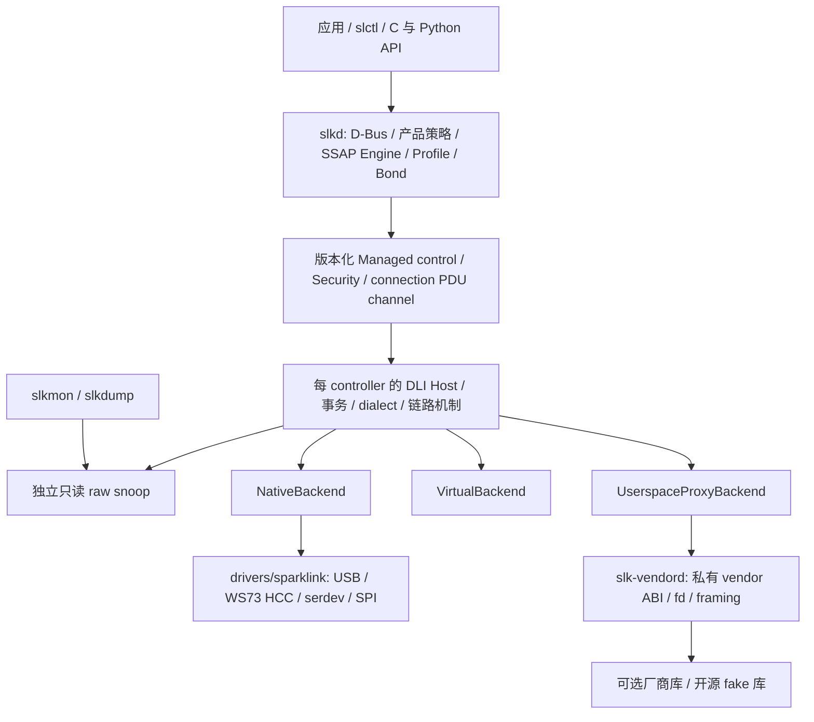
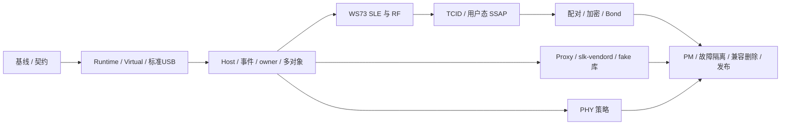

# SparkLink / Linux 联合实施方案

规划基线：2026-10-09。覆盖 Linux #1–#19、sparklink #1–#7 的全部现有范围；逐项验收仍以各 issue 的原始 checklist 为准。本文件描述目标设计和执行顺序，不能作为功能已经完成的证明。

Linux 主跟踪：[厂商框架与 WS73 #8](https://github.com/OpenSparklink/linux/issues/8)。联合跟踪：[跟踪：Linux 与用户态 SparkLink 全部 issues 的联合实施和验收](https://github.com/OpenSparklink/sparklink/issues/8)。本文中的 `K#n` 指 OpenSparklink/linux，`U#n` 指 OpenSparklink/sparklink。

## 第一北极星与优先交付路径（2026-10-10）

**普通用户通过 slctl 选择两只真实 WS73，让一只广播、另一只发现它；
交换角色和拔插后仍能重复成功。** 两只独立 Ready，每轮随机标识，
10 秒内显示匹配数据/地址/RSSI；交换角色连续 20 轮；单设备拔出不影响
另一只，重插无需重启 slkd；应用无需 sudo，并留存可复现测试和真实空口
证据。详细定义与阴性对照见 [北极星验收](WS73_DISCOVERY_NORTH_STAR.md)，
联合里程碑为 [U#10](https://github.com/OpenSparklink/sparklink/issues/10)。

按 **最小每设备 Runtime → WS73 启动/HCC/BSLE → 真实 DLI 查询 →
广播/扫描 → 内核事件 → 动态 adapter/slctl** 推进 S1–S3 相关纵向路径。
Virtual 作为开发支撑，不能替代真实双设备验收。之后扩展四设备两组并行。
完整 S0–S6、原 issue checklist 和 CI/安全门禁均保留；SSAP/配对策略等
后续完整功能不作为此第一条广播/发现路径的前置依赖。部分成果不关闭整项 issue。

## 当前实施与证据（2026-10-11 重审）

最新生产审查基线 Linux `fc0b4d1a44b6` / 用户态 `157ec71c3b9a`；
后续 Linux `376bb1e8a544`/`c2c4aa4ad0bd` 已约束R01/R02/R05，并完成
[新VM 20+2轮及人工恢复回归](evidence/ws73-vm-cleanup-regression-20261011.json)；
后续9f57d1e拒绝无效/被忽略配置策略，34b54fd隔离未接通实验服务并恢复严格
本地质量基线；[新默认daemon回归](evidence/ws73-vm-config-cleanup-regression-20261011.json)
复核真实20+2轮与独立USB佐证；[8a9cc28最新实机](evidence/ws73-vm-strict-ci-regression-20261011.json)
最长775ms，[9个CI作业全部通过](https://github.com/OpenSparklink/sparklink/actions/runs/38077403740)。
完整安全/其他backend未验收，剩余缺陷、完整R14
矩阵与所有整项issues仍开放。具体状态以[整改计划](REVIEW_REMEDIATION_20261011.md)及后续
提交证据为准。历史 image #33–#35/USB 不可见/固定 slk0 等阶段描述不代表现状；
完整历史失败与协议来源保留在下文及北极星开发记录中。

已验证：每设备 Native WS73 Runtime、HCC/BSLE/DLI、typed discovery、管理租约、
独立事件与 snoop、动态 adapter/slctl；VM 两只真实 WS73 20+2轮、普通 UID/caps0、
同 daemon、物理拔插重接。[物理证据](evidence/ws73-vm-physical-20261010.json)
仍保留 xHCI 警告；[一次人工错误恢复支持](evidence/ws73-vm-artificial-recovery-20261010.json)
证明单设备有限恢复/幸存者/2轮恢复 RF，不代表自然根因或完整自主恢复验收。
U10 保持7/8，四设备两组、完整 sandbox、连接/SSAP/安全/Bond/Profile/Proxy 待验。

采用[ADR 0001](decisions/0001-management-channel-service-boundaries.md)：每逻辑
通道独立 socket fd 是连接阶段最终数据面；管理、事件、诊断和 Proxy 独立。
SSAP codec/协商/事务/数据库/Profile 在 slkd，内核拥有链路机制与可信状态。
执行[调用审计三类清单](LEGACY_CLEANUP_20261011.md)，与生命周期/恢复并行；
先拒绝不可靠能力和恢复严格 CI，再连接 socket、用户态 SSAP/安全/Bond/Profile，
四设备两组，其他 Native/Proxy。不以语言、行数或 ioctl 数量声称优于 BlueZ；
[重新核对的竞争分析](BLUEZ_COMPARISON.md)按可重复行为与官方接口证据比较。

## 目标架构与所有权

### NearLink Host 参考纳入（2026-10-10）

用户提供 `communication_nearlink_service` 后，增加固定 revision 的 Host 参考
复核。完整来源表及决定见本地 `docs/NEARLINK_HOST_REFERENCE.md`。
S0 加入协议差异与来源清单；S1/S2 明确 standard DLI / WS73 / reference profile；
S4 先交付本地 SSAP V1.2.0，参考中的 1.3 fragment/multiProcessing 扩展需单独
核验和 feature gate；S5 检查安全方法、lcid 与失败路径；S6 增加独立差分 harness。
参考的 0x0401=SetEventMask 与本地新版 DLI 冲突，不能机械复用。真实 OpenHarmony
HAL 依赖外部 HDI，local test 桩模拟回复；未完成参考构建/运行前不报差分 PASS。
每 controller 所有权、Linux 内核机制 / slkd SSAP 与 policy 分层、WS73 优先级及
全部原验收 checklist 保持不变，不引入无关联 issue 的音频/测距产品范围。

| 层 | 拥有的内容 | 接口约束 |
|---|---|---|
| `net/sparklink` | 每 controller 的 Host、标准及显式 WS73 dialect、pending、连接/TCID、低层分片/credit、安全机制、PHY 合法性与原子应用 | Backend 只收发完整 DLI wire packet，不决定标准 opcode、SSAP 或 policy；dialect 编解码由 Host 完成 |
| `drivers/sparklink` | bus match、固件、端点、HCC/BSLE、URB、内部 DliChannel、power/recover | register/unregister + start/send/stop/recover + RX/fault/hangup；硬件差异不进入应用 API |
| `slkd` | 唯一 Managed writer；启用策略、Agent/trust、持久化 Bond、SSAP codec/session/MTU/数据库、Profile、PHY policy | 每 controller/connection 独立状态；应用写操作通过 D-Bus 授权；不加载厂商库 |
| `slk-vendord` | 独占 Proxy lease；受控库映射、typed vendor lifecycle、vendor fd、framing | 和 slkd 分进程；厂商 `op(int, void*)` 只存在内部；崩溃只影响对应 controller |
| 工具 / 绑定 | 独立只读状态和 snoop；普通控制经 slkd | raw Diagnostic 是受权独占模式；不与 Managed writer 并行改硬件 |

源码注册、产品启用、Backend present、Controller Ready 是四个独立事实。安装驱动或库、进程启动、USB runtime 枚举均不表示 Ready。能力和限制包含来源与 known/unknown；未确认不能默认支持。WS73 先支持 USB NativeBackend，闭源厂商路径按独立 Proxy 方案并行推进。

## 标准基线与章节映射

用户提供的本地标准归档已定位为相邻目录 `../sparklink-standards`；其 `00_标准清单.csv` 记录版本和 hash。本方案使用该归档的版本，不宣称它们是联盟当前最新版本。标准正文、测试规范、故事图解分开；故事图解只作辅助。源码现有注释与常量必须重新和正文/表格核对。

| 归档标准 | 重点章节 | 实现与验收归属 |
|---|---|---|
| T/XS 00001-2025 V2.0.0 架构 | §6–§9 | 分层/传输通道与功能归属；K#1/#6，U#3 |
| T/XS 10003-2025 V1.1.0 数据连接接口 | §6–§9；§10 测试；附录 B/C/D | 标准 transport/packet/opcode/event/错误码；K#2/#11/#13/#16/#19 |
| T/XS 10002-2025 V2.1.1 SLE | §7、§9、§11/§13；加解密示例附录 F | 链路机制与安全/测试向量；K#7/#18/#19，U#5 |
| T/XS 20001-2025 V1.2.0 设备发现与服务管理 | §6、§7.2–§7.4、UUID 附录 B | 广播/SSAP Engine、权限、协商、事务、Profile；K#2/#6，U#3 |
| T/XS 20002-2025 V1.1.2 传输与控制规范 | §6–§8 | TCID、传输模式/帧/分片、连接能力与测量；K#6/#17，U#3/#4 |
| T/XS 40001-2022 V1.0.0 网络安全通用要求 | §6–§9 | 安全/授权/凭据/日志；K#5/#7，U#5/#7 |
| T/XS 30011-2025 V1.1.0 电量信息管理 | §7、附录 A | 正确 Battery service/attribute/权限；U#3 |
| T/XS 30004-2025 V1.1.0 HID 数据交互；30013-2025 V1.1.0 HID 应用配置 | 30004 §7–§10/附录 A；30013 §6–§9 | HID+DeviceInfo 服务、描述符/权限、数据路径；U#3 |
| T/XS 30012-2025 V1.1.0 设备信息管理 | 正文/UUID 表，实施前逐项核对 | HID 的必选服务依赖；U#3 |
| T/XS 50003-2025 V1.2.0 SLE 设备测试 | §4 的 mandatory/conditional 特性矩阵 | 按实际角色/能力选择测试；K#19 |
| T/XS 50004-2025 V1.2.0 基础服务层测试 | §6–§11；数据集附录 | discovery/connection/SSAP/data 与异常；K#6/#17/#19，U#3 |
| T/XS 50005-2025 V1.0.0 电量信息服务测试 | §6–§9；数据集附录 | Battery discovery/read/descriptor/notify/indicate；U#3 |

已核对的设计约束：标准 TCID 是按 peer 独立的一字节标识，local/remote TCID 可不同；WS73 envelope 的 LE16 表示只属于方言适配。默认 SMTC 使用基础模式，可靠 SSAP 需分别协商连接与 SSAP 能力后建立可靠通道。SSAP、底层流/可靠 SDU、USB/HCC/ACB 三层分片独立；默认基础模式不能借任意底层切分替代 SSAP 分片。

SSAP Engine 先 ExchangeInfo，再使用协商 MTU/扩展码/分片/事务号/可靠能力；未协商事务号时，每 peer/channel 的 request-response 与 indication-ack 各自单在途，双向交互按标准 30s 失败门禁；command/notify 不受该等待阻塞。分片 timer、丢片/断链、属性修改的不确定状态按正文错误语义测试。

当前 Battery 使用 Bluetooth 的 `0x180F/0x2A19`，须按星闪标准改为 `0x060A/0x1034` 并验证描述符/权限/通知；DeviceInfo 的旧 `0x180A` 须重新核对 30012。HID 不能仅靠 callback unit test 宣告符合，需完成应用配置及必选 DeviceInfo 依赖。标准没有规定 SSAP 必须在哪个 OS 层，迁入 slkd 是本项目的明确架构选择。

每条验收增加 `标准号/版本/hash → 章/表/规范用例 id → 角色与 mandatory/conditional 判定 → 实现 → golden/负向测试 → 实机证据`。标准内部疑似勘误单列（例如 DLI §7.2 表 7 的范围与分组规则），结合具体命令表/实际 wire 核对，不盲抄；固件不支持或偏离标准的能力显式报告，不能由 Host 伪造符合性。完整正文 PDF 保持本地归档，不附到公共 issues。

### Controller runtime 与生命周期

每个对象拥有：稳定 controller id、递增 generation、parent device、可引用 Backend handle、descriptor、Host/codec/pending、RX/TX 有界队列与 worker、连接和安全状态、订阅者。注册表只索引可引用对象，不负责切换全局协议状态。相同 peer 地址也按 controller 分区。

生命周期为 `Registered → Starting → Initializing → Ready → Enabled`，另有 `Suspended / Recovering / Fault / Removing / Dead`。Ready 必须包含 Backend channel 可用、初始化通知及 Host 真实查询成功；Enabled 由产品/管理策略决定。停止先禁止提交、使旧 generation 失效，再在锁外停止 Backend、取消/drain worker 和 pending，最后撤销对象。注销返回后不得再访问释放对象。

URB/serdev 原子回调只执行受界限的拷贝/排队与调度；协议解析和可睡眠操作在 per-device worker。全局/registry 锁不覆盖 USB I/O、用户态等待或同步取消。异步结果附 controller/generation，过期结果丢弃并计数。模块/FFI 所有权保证 callback 存活；外部接口最多提供小型版本化 C seam，不承诺稳定 Rust ABI 或任意模块组合。

### Host transaction 与事件

Host 提供 typed 广播、扫描、连接事务，编码完整参数和顺序，处理 Status、Complete 与领域完成事件。发送成功只表示提交成功。命令响应只完成原 requester；状态 fan-out 给所有独立订阅者；raw TX/RX snoop 保留独立队列、序号及 overflow 计数。事件携带 controller、generation、类型和本地 request cookie。

本地 cookie 不会被固件自动回传。无 wire transaction id 时限制在途请求；同 opcode 超时后不能把迟到回复关联给新请求。使用保守排队/隔离或 reset generation，并通过故障注入证明。高流量和慢 snoop 不能阻塞状态更新；每路 overflow 明确可见；poll/epoll 由事件到达唤醒，主路径移除 50ms 补偿轮询。

### UAPI、权限与兼容

以 Linux `include/uapi/linux/sparklink{,_ioctl}.h` 为 ABI 规范来源；新接口包含固定宽度 version/size/flags/reserved、长度/队列上限、controller/generation/sequence。C、Rust、Python 比较同一字段的 size、align、offset、enum 和 ioctl 编号，覆盖成功打开和真实调用；布局测试不只比较复制的常量。结构升级采用新版本/编号或协商，禁止静默改旧布局。

三个 owner 相互独立：slkd Managed writer、slk-vendord BackendProxy owner、用户态 per-connection PDU owner。重复 owner、错误 id/lease/generation、非法状态/长度均拒绝。只读订阅与 owner 分开；Diagnostic raw 需 CAP_NET_ADMIN 并独占，进入前停止 Managed writer 的冲突活动。configfs 仅启动配置；debugfs 仅诊断；genl 与 ioctl 不再形成多个无协调写入口。32/64 位兼容与保留字段纳入 conformance。UAPI 未发布，调用者同步迁移后直接删除旧 API，无旧 ABI 兼容期。

Proxy v1 使用有界 `read/write/poll`，包括 REGISTER、START/STOP/RESET/RECOVER、READY/FAILED/FAULT/HANGUP/UNREGISTER 与完整 packet。fd-close 自动 detach，旧 lease/generation 不能重新注入。READY 是初始化事实声明，Host 仍真实查询验证。先测复制/切换成本，再决定是否引入可协商 mmap ring，不让共享内存成为 v1 前提。

### SSAP、安全与 PHY

内核最终 connection channel 是每逻辑通道独立 socket fd，定位 controller/generation/connection/peer/local+remote TCID，提供完整 SSAP PDU、顺序、bounded queue、断链和安全上下文；不拥有服务数据库。slkd Engine 拥有 codec、MTU、SSAP 分片、协商后事务、超时、remote cache、handle 分配与 Profile callback。Profile request context 包含请求 id、连接、attribute/op/offset/payload/security/deadline；read/write/method/notify/indication+ack 经真实 PDU 路由。属性/描述符的读写、认证、加密和授权分别校验。

内核保留配对时序、密码学、active credential、加密安装和强制机制；slkd 决定方法、MITM、接受/拒绝、Agent/passkey/OOB/PSK 和 trust。没有 owner、拒绝、超时或 owner 崩溃均 fail closed。Bond 采用可恢复的 wrapped credential baseline，按 controller+peer 持久化，原子写入、安全目录、0600、格式版本及敏感缓冲清理；仅有 fingerprint 不合格。opaque token 只在明确 capability 时启用。revoke 同时撤销持久存储、内核/RAL 与可选 token。默认 D-Bus 可读，写入需 root/polkit 或等价授权。

PHY mechanism 校验 runtime capability、法规和参数并报告实际结果；slkd 提供 Fixed/Balanced/Throughput/LowPower 策略、hysteresis、minimum dwell、failure backoff 和公平调度。配置目标与 actual state 分开，未知能力不会触发自动切换。

## 执行顺序与阶段门禁

issue 间的依赖分为“接口契约可协作设计”和“最终验收必须等待”。K#4 与 K#9 不互相等待整项关闭：先共同固定 controller ownership contract，再迁移、联调、分别验收。所有阶段可提前开发 pure codec、fixtures、fake 和文档；不得用 fake 结果替代实机。

| 阶段 | 主要工作与 issue | 退出条件 |
|---|---|---|
| **S0：可信基线** | K#1/#5/#13/#19、U#1：修 selftest verdict / ABI 漂移 / 同步 fd 的 Tokio 依赖；清理 fmt/clippy 与严格 CI 基线；冻结源码、toolchain、config；Host/Backend/owner ADR 和 WS73 证据矩阵 | 故意失败不能 PASS；C/Rust/Python conformance 通过；30s 静默事件期间并发 D-Bus 响应和 shutdown 正常；严格质量检查及现有基线失败明确 |
| **S1：每设备骨架** | K#4/#9/#10/#11/#12：可注册 runtime、descriptor、引用/模块所有权、generation；先实现真实 VirtualBackend，再迁标准 USB | 两 controller 交错同 opcode、inactive RX、不串状态；register 不冒充 Ready；失败/注销无 UAF/睡眠原子上下文；无 USB 的 core+Virtual 可构建 |
| **S2：公共 Host 与控制面** | K#2/#3/#5；U#2/#6：typed transaction、统一事件/snoop、Managed owner、动态 adapter 对象和枚举快照 | Virtual 和标准 QEMU USB 同一事务通过；迟到/重复/丢失事件与多 reader 负向通过；无锁内 I/O；独立 Enabled/Available/Powered 可观察 |
| **S3：优先完成 WS73 RF** | K#13/#14/#15/#16：USB/HCC/BSLE、固件/取消、Host dialect、真实版本/buffer、广播扫描建链断链 | G0 boot → G1 SLE/真实 DLI → G2 RF；标准 codec 不受影响；四设备独立 Ready，失败阶段明确；TX/RX capture 可复现 |
| **S4：真实数据与用户态 SSAP** | K#6/#17；U#3：TCID/ACB/credit、PDU owner、用户态 Engine/Profile、工具/绑定迁移 | G3 两组双向数据、长 PDU/253–255B 边界、真实远端 Profile callback/read/write/notify/indication；daemon crash、满队列、断链有确定结果 |
| **S5：安全、策略与 Proxy** | K#7/#18 与 U#5；U#4；K#1/#5 与 U#7 独立分支 | G4 实机配对/加密、Bond 重启重连与 revoke；PHY policy replay/实际能力门禁；fake vendor 全生命周期/权限/crash 端到端。真实闭源库未提供时明确未验证 |
| **S6：收敛与发布** | K#8/#19 及所有剩余 checklist：PM、hotplug/mixed backend、诊断构建、构建/模块组合、迁移删除、文档/包 | G5/G6、所有原验收项对应证据；关闭已满足 issue；支持矩阵区分模拟、实验、硬件验证；总跟踪最后关闭 |

下一批先交付 S0 的可复现修复；WS73 的 HCC/BSLE fixtures 与 S1 runtime 同时推进。WS73 Native 的 RF 闭环优先于完整 opaque vendor 支持。每批保持编译和相关回归可运行，不将全部代码重写为一次不可审查提交。

## 全部 issue 到设计 / 验收的映射

| Issue | 阶段与实现内容 | 完成必须额外看到的证据 |
|---|---|---|
| [K#1](https://github.com/OpenSparklink/linux/issues/1) | S0 契约；S1–S2 Host/Backend/DliChannel；S5 Proxy | Virtual、真实 Native、fake OpaqueVendor 使用同一 Host transaction；边界及迁移文档 |
| [K#2](https://github.com/OpenSparklink/linux/issues/2) | S2 typed adv/scan/connect；S3 实机 | 完整参数/顺序/回滚和 status/complete/domain 关联，实机 trace，无合成成功 |
| [K#3](https://github.com/OpenSparklink/linux/issues/3) | S2 独立订阅、requester completion、raw snoop | slkd+mon+dump 同时运行，立即唤醒、overflow、慢 reader、重开 |
| [K#4](https://github.com/OpenSparklink/linux/issues/4) | S1–S2 每 controller 独立 Host/状态/worker | 无 active swap；至少双设备并行、同 opcode 交错、单侧拔出不影响另一侧 |
| [K#5](https://github.com/OpenSparklink/linux/issues/5) | S0 ABI；S2 owner/权限；S5 Proxy | 非 root 负向测试、raw/Managed 冲突、stale generation、长度/保留字段、跨语言真实调用 |
| [K#6](https://github.com/OpenSparklink/linux/issues/6) | S4 connection PDU channel 与 SSAP 迁移 | 独占 owner、完整 PDU/安全上下文、重组/flow control、crash；内核旧 DB 退出权威 |
| [K#7](https://github.com/OpenSparklink/linux/issues/7) | S5 Security request/action/credential | 无 owner/crash/deadline fail closed；wrapped restore/revoke；optional token unsupported 明确 |
| [K#8](https://github.com/OpenSparklink/linux/issues/8) | S0–S6 Native WS73 总跟踪 | 关联子项及所有真实硬件 gates 完成后关闭 |
| [K#9](https://github.com/OpenSparklink/linux/issues/9) | S1 register/unregister + Backend handle | 新驱动不改 enum；引用、模块、callback/teardown 竞争和失败回滚 |
| [K#10](https://github.com/OpenSparklink/linux/issues/10) | S1 生命周期；S6 PM/recover | Ready 门禁、取消/generation、recover timeout、suspend/resume/reset-resume |
| [K#11](https://github.com/OpenSparklink/linux/issues/11) | S1 descriptor；S3 能力查询 | bus/dialect/identity/caps/limits/quirks 分开；每项证据来源，unknown 不变成默认能力 |
| [K#12](https://github.com/OpenSparklink/linux/issues/12) | S1/S3 drivers 迁移；S6 build 矩阵 | core 无 USB 依赖；标准 USB/WS73/Virtual 独立选项；已支持的模块组合和卸载 |
| [K#13](https://github.com/OpenSparklink/linux/issues/13) | S0–S3 wire/source/license 矩阵 | 参考/SDK/本项目 capture 分列；0x0401 冲突、completion 偏移、single-link/254B 逐项核验 |
| [K#14](https://github.com/OpenSparklink/linux/issues/14) | S3 per-device USB/HCC/scatter/worker | 原子安全、RX 聚合长度/fragment、TX 背压、short/stall/cancel/拔出，不串设备 |
| [K#15](https://github.com/OpenSparklink/linux/issues/15) | 已有 boot 第一切片；S3 BSLE/SLE | BSP_READY→customize→CUSTOMIZE_RECEIVED→SLE_OPEN→BOOT_FINISH→DLI 查询；warm/cold/missing/corrupt/notify timeout |
| [K#16](https://github.com/OpenSparklink/linux/issues/16) | S2 Host 通用；S3 WS73 codec | A1/A2 wire golden 和真实 Version/Buffer/adv/scan/connect completion，credit 和 timeout |
| [K#17](https://github.com/OpenSparklink/linux/issues/17) | S4 TCID/ACB/credit/PDU | TCID 不当作连接 handle；253/254/255 边界、分片/重组、credit 耗尽与恢复；实机双向 |
| [K#18](https://github.com/OpenSparklink/linux/issues/18) | S5 SMP relay / 加密 mechanism | relay layout/算法来源；双角色真实 pair/encrypt、错 key、revoke、Bond reconnect |
| [K#19](https://github.com/OpenSparklink/linux/issues/19) | 每批证据；S6 全矩阵 | 严格 verdict、Virtual/标准 USB/WS73 分开；mixed backend、故障/PM/性能/复现与支持范围 |
| [U#1](https://github.com/OpenSparklink/sparklink/issues/1) | S0 独立 receiver/cancel、短锁、同步 fd 分离 | 真实 D-Bus 静默 30s 仍响应；对象 signal 在锁外；并发更新与 shutdown |
| [U#2](https://github.com/OpenSparklink/sparklink/issues/2) | S2 StateSubscription/SnoopSubscription | 与 K#3 联调，工具不抢事件；移除主路径破坏性 poll/50ms fallback |
| [U#3](https://github.com/OpenSparklink/sparklink/issues/3) | S4 SSAP Engine/session/DB/Profile；修标准 UUID/权限 | goldens+malformed+MTU/长读写；未协商事务号时单在途；真实 Battery/HID/DeviceInfo PDU；restart/卸载/并行连接 |
| [U#4](https://github.com/OpenSparklink/sparklink/issues/4) | S5 每连接 PHY policy | telemetry replay 的 hysteresis/dwell/backoff/clamp/rollback/fairness；只广告真能力 |
| [U#5](https://github.com/OpenSparklink/sparklink/issues/5) | S5 Agent、凭据 store、授权 | accept/reject/timeout/crash；restart 无重新配对重连、损坏 store/revoke/权限负向 |
| [U#6](https://github.com/OpenSparklink/sparklink/issues/6) | S2 registry/adapterN；S3/S6 多设备 | snapshot+event race、同地址 peer 隔离、disable 不开 channel；四设备对象与重插 generation |
| [U#7](https://github.com/OpenSparklink/sparklink/issues/7) | S5 backend-client、vendord、fake adapter | root-owned 库映射、ABI/缺库拒绝、epoll partial I/O、owner/stale/corrupt/crash/timeout、隔离与 benchmark |

## WS73 实现细节与协议证据

1. **USB / 固件**：匹配 `ffff:3733` 的目标接口；boot 两端点、runtime 五端点重新验证 address/type。三份 SDK 镜像校验 64B ASCII SHA-256 header 和上限，在任何写入前全部通过。boot READM/CLDO/trim/FILES/QUIT 保持独立可重现；校准和地址来自明确设备配置，禁止把参考测试 MAC/zero ini 当产品默认。firmware 不提交内核，来源与再分发许可另行记录。
2. **BSLE / HCC**：runtime 尽早启动 bulk/INT RX，避免漏一次性通知；阶段有独立 timeout/cancel，顺序是 BSP_READY、queue10 customize、CUSTOMIZE_RECEIVED、SLE_OPEN、BOOT_FINISH 或实测证明的等效通知、queue8/reset assembly。HCC header/offset64/scatter 与 DLI frame 分层校验，硬件 startup 只在 Native 内部。
3. **Host dialect**：显式 WS73 profile 的 A1 command / A2 event 长度和 completion payload；`0x0401` 与标准含义冲突只能在 dialect 映射。标准 codec 保留独立 fixtures。Host 查询版本和 buffer，控制命令 credit；参考偏移与 max limit 必须由当前 SDK 固件 trace 确认。
4. **数据**：A3 envelope 的 flags、seglen、TCID、PDU length 在 Host/data mechanism 层处理，USB/HCC 只运完整 packet。分清 SSAP MTU、ACB frame 限制、低层分片与 controller credit。参考 254B SMTC/单链路是候选限制，不是所有 WS73 的已验证事实。
5. **安全**：先确认 SMP relay opcode/事件、P-256/CMAC 或固件实际算法、encryption install 参数；复用内核机制和上层 policy。参考 RequestPair/StartPair 被拒绝的结果不直接复制为本项目结论。

每条协议事实记录来源版本、原始 bytes、解释、候选限制、对应 fixture、本项目实测与差异。引用 LGPL 参考时审查实际代码复制和链接义务；内核新 GPL 实现基于协议事实，不能未经审查搬运实现代码。SDK 固件许可未知时仅使用用户本地文件，不增加再分发承诺。

## 开发环境与权限

保留主机编译 + 单层 headless QEMU。无需新增编译 VM 或嵌套虚拟化。普通/诊断构建使用不同 out-of-tree 目录；构建 kernel、userland、打包均不需要 sudo。硬件运行需要执行环境实际暴露 `/dev/kvm`、四个 USB node，并具备读写权限；管理员一次性安装的 WS73 专用 udev rule 继续适用于重新枚举。不要给完整 USB 控制器权限。若环境当前未暴露设备，提权不能代替设备透传；先做 TCG/纯软件测试，结果注明 simulation。

lab 使用独占锁，固定物理端口→guest 端口→controller/generation；每个设备一个 owner。现有 minimal initramfs 用于 boot/DLI，另建包含 daemon、私有 D-Bus、工具和非 root 测试用户的用户态测试镜像。Bond 重启测试使用 guest 专属可持久化磁盘。guest 不默认共享主机文件系统、网络或真实系统盘。

QEMU 释放 USB 后可能需要物理冷重插，当前不能保证全自动恢复。QMP detach 证明 guest teardown，不能代替断电冷启动。保存完整 QMP、前后 inventory、失败阶段和恢复步骤；先稳定逐个启动四设备，再单独修复/验证并发下载问题。

## 测试矩阵与实机 gates

| 层级 | 自动验证内容 | 结果能证明的范围 |
|---|---|---|
| Pure codec / 状态机 | 标准/WS73 golden、H4/HCC/ACB 长度和畸形帧、SSAP/SMP vectors、PHY replay | 编解码与状态机；不能证明 USB/RF |
| VirtualBackend | 同 opcode、重复/延迟/丢失 completion、异步插入、reset generation、register/stop/crash、每设备隔离 | Host/生命周期/故障处理；不能证明 Native 硬件 |
| ABI / 用户态 | C/Rust/Python conformance、同步成功 open、真实 D-Bus 并发、Agent/store/Profile | 接口、锁、权限和 user engine；fake PDU 单列 |
| 标准 QEMU USB | 明确指定存在的模型；URB/worker、多控制器、hot-remove、callback teardown | 标准 Native transport；模型缺失不得降级 PASS |
| fake OpaqueVendor | REGISTER→start→ready→查询→data→reset/recover→unregister；malicious/partial/EAGAIN/crash | Proxy/vendord 边界，不证明未提供的真实闭源库 |
| 真实 WS73 | G0–G6，含真实 peer 接收 capture | 对应固件/角色/能力的实机行为 |
| 诊断配置 | lockdep/DEBUG_ATOMIC_SLEEP；可支持的 KASAN/KCSAN/fault injection 分别构建运行 | 并发/内存检查；不假定所有工具和 Rust 配置可同时启用 |

故障注入必须覆盖旧 generation RX、迟到完成、worker 未结束时 unregister、malformed/oversize/queue full、slow reader、owner close/crash、错误 credential、缺 policy owner、USB short/stall/cancel、missing/corrupt firmware 和通知超时。pack 的固件拒绝仅是打包器测试；内核 missing/corrupt 路径使用专用负向镜像证明。

四设备固定 A↔B 与 C↔D 两组，每组交换 initiator/acceptor，不预设一对三星形能力。

| Gate | 实机退出条件 |
|---|---|
| **G0 Boot** | 四设备 cold 下载、runtime 枚举；warm/缺固件/损坏/拔出分开记录。已有旧 run 仅提供正向 boot 证据 |
| **G1 Ready / DLI** | 各自 BSLE/SLE、真实 version/buffer/features；可用能力来自各自查询，失败不标 Ready |
| **G2 RF** | A 广播、B 扫描建链，C/D 同时 discovery；交换角色；断链原因来自真实事件 |
| **G3 Data / SSAP** | 两组同时连接，用 controller/connection/seq 标记不同 payload；双向无串包、credit/253–255B/长 PDU；远端 PDU 触发 Profile、读写/通知/确认 |
| **G4 Security** | 双角色授权配对、实际加密数据、拒绝/timeout/错 key；daemon 与 guest restart 后 Bond 重连、不重新配对；revoke 后不能恢复 |
| **G5 Isolation / PM** | 保留 C↔D 业务时 reset/拔出 A 或 B，其他对象/订阅/调用持续；suspend/resume/reset-resume 与重复循环 |
| **G6 Mixed / 性能** | 标准 QEMU controller 与 WS73 同 guest；可选双 guest 各两设备。记录吞吐、RTT、掉包、credit stall/队列、payload/时长；先测基线再设目标 |

CI 每 PR 跑 fmt/check/clippy/unit/golden/ABI/Python/私有 D-Bus；有适用模型的集成 runner 跑 Virtual/标准 USB/Proxy fake；真实硬件 runner 串行执行 lab。任何 required test 未执行、timeout、FAIL、kernel BUG/WARNING 或缺预期用例均不能成为 PASS；不适用项使用明确 SKIP 及原因。先验证测试工具自身的失败判定。

## 迁移与删除条件

迁移期间同一 controller 不能同时拥有两套 Host。新 runtime 接通调用者和回归后删除 legacy；UAPI 未发布，内核/Rust/C/Python/CLI/daemon 同步替换，直接移除旧接口，不承诺旧布局兼容或永久迁移开关。文档列出实际支持组合和迁移门禁。

| 旧路径 | 删除前必须满足 |
|---|---|
| Backend enum / 核心 switch helper | Native+Virtual+Proxy 按注册表运行，模块/注销/失败回滚与 mixed backend 通过 |
| active_dev_id 协议状态交换 | 所有 parser/pending/RPA/conn/security/worker per-controller；双设备/四设备无串扰，inactive 生命周期不丢 |
| 破坏性 DLI_POLL_EVENT / 50ms fallback | slkd/mon/dump 独立订阅、立即 wakeup、overflow/reopen 通过；旧 client 明确弃用 |
| 内核 SSAP Engine / 数据库 | user Engine 是唯一权威，真实 Profile/PDU、绑定/CLI兼容、MTU/timeout/crash 通过 |
| 内核自动配对 / 自动 PHY policy | policy owner 正常和缺失/crash fail closed；真实安全、凭据恢复及 policy replay 通过 |
| 多入口任意管理写入 | 普通应用经授权 D-Bus；Managed/Diagnostic/Proxy/channel 各自唯一 owner，负向权限和旧工具迁移通过 |

回滚允许切回明确的实验配置或上一版本；不得回滚成虚假 Ready、无权限 raw 控制或旧全局状态和新 Host 同时运行。驱动和 daemon package 的 installed/enabled/present/ready 分开，文档及配置避免以默认启用隐藏失败。

## 证据与 issue 维护

每次运行保存 manifest：case/issue/预期结果、Linux+用户态 commit 和 dirty diff hash、kernel/initramfs/二进制 hash、完整 config、工具/model 版本或 hash、QEMU argv、firmware/hash/校准来源、匿名设备角色与物理→guest→controller/generation 映射、前后 inventory、PASS/FAIL/SKIP 及原因、console/QMP/去敏 snoop/peer capture、统计和恢复步骤。密钥及敏感 credential 不写日志。

每批更新相关 issue：“具体修改 + commit/本地待提交状态 + 实际运行命令及证据 + 剩余 checklist/未验证范围 + 下一依赖”。部分验收勾选须有证据；所有原 checklist 满足才关闭。总跟踪保留开放直到子项和 gates 全部完成。环境阻塞仅标在受影响的硬件验收项，不把整个项目标为无法推进。文档中的历史代码量、测试数量和‘完成’标签不替代最新验收。

### 首批 S0 历史记录（内核待提交；用户态见交付记录）

- 自测 396 处 FAIL 进入计数，95 个 case 共用执行/manifest；失败退出 1、skip 退出 4。runner 校验完整 case、summary、USB 数量、guest/QEMU exit 和 kernel fault，模型缺失明确 SKIP；25 项反向/截断/异常测试通过。
- 修复 Python ConnInfo 和 Rust/C/Python DliInfo 漂移；真实 cbindgen 0.29.4 生成并 verify；23 项 Python 测试检查 11 个结构/100 字段及 C 写入。kernel 规范布局未变，Cargo.lock 未变。全部 ioctl/结构、32 位和实际设备调用仍待补齐。
- lab 增加独占锁、build/pack/run manifest、config/artifact/firmware/source hash、完整 QMP 和严格 gate；16 项 synthetic fixture 回归通过，真实本地 SDK pack 成功。旧镜像须重新 build/pack 生成来源绑定，旧 run 不追补 hash。没有在本轮启动 VM。
- `cargo test --workspace --locked`：118 项通过；`cargo clippy --workspace --locked -- -W clippy::all`：退出 0、有现存警告；`cargo fmt --all -- --check`：失败，作为 S0 基线待清理。测试通过不意味着当前严格 CI 绿色。
- 上述首批尚未完成的锁/fd 工作已按以下第二批推进；ADR 具体接口、完整标准用例抽取、Virtual/注册框架或任何新增 SLE/RF gate 仍未完成。没有关闭 issue。

### 第二批 S0 历史记录：事件等待与同步 fd

- `Adapter` 改用同步 OwnedFd；C/Python 和 CLI 成功 open 不再需要 Tokio。`EventReceiver` 独占异步 fd；slkd 独立打开并把接收任务从 SharedState 分离，正常 cancel+join 后释放 D-Bus connection，异常 drop 则 abort。
- 真实私有 session bus 回归稳定复现旧持锁等待使 Name 超时；修复后 30s 无事件期间 Name/GetDliInfo/StartDiscovery/ConnectDevice 均响应，静默后广播事件能更新状态并注册真实 Device object。测试使用 mpsc 事件源和 `/dev/null` 的真实 ioctl 错误，不伪造控制器成功。
- workspace 124/124 通过；receiver transport drop、无 runtime 同步 Rust/C open、超长/截断事件错误、cancel/join 均覆盖。随后广告 parser 两项严格 clippy 修复的 19 项相关测试、libsparklink 9 项测试及 all-targets `-D warnings` 均通过；cbindgen verify 和所改 Rust 文件格式检查通过。
- 本机没有 dbus-daemon，已从 Fedora 仓库下载并验证 RPM 签名，仅解包到 `.dev/tools/dbus` 使用 1.16.2；CI 明确安装该测试依赖。日志为 `.dev/s0-event-loop-test.log`，复验/所有权与边界见 `docs/EVENT_RECEIVER.md`。
- U#1 原短临界区验收仍需处理旧同步 Bond 持久化与 Profile 回调。独立 fan-out/snoop 属于 K#3/U#2，legacy 50ms fallback 未缩短；本批不宣称这些已实现。全仓质量基线仍待清理，issues 保持开放。

### S0 用户态交付记录（2026-10-10）

- 签名提交并推送到 `codex/sparklink-ws73`：[格式基线 01536db](https://github.com/OpenSparklink/sparklink/commit/01536db)、[ABI 787ac84](https://github.com/OpenSparklink/sparklink/commit/787ac84)、[事件/Bond/Profile 隔离 dd2074c](https://github.com/OpenSparklink/sparklink/commit/dd2074c)、[输入与工具 lint 7adb796](https://github.com/OpenSparklink/sparklink/commit/7adb796)。这些用户态改动现可从远端检查；内核 boot/lab 修改仍待 QEMU gate 后提交。
- 代码提交对应的软件复验：`cargo test --workspace --locked` 135/135，Python compiled ABI 23/23，`cargo fmt --all --check` 和六 crate 的 all-targets clippy `-D warnings` 通过，cbindgen verify 通过。测试使用工作区 dbus-daemon 与私有总线；沙箱运行因禁止 Unix socket 返回 EPERM，允许本地 socket 后完整回归通过，未跳过失败项。
- Bond 存储与旧连接 Profile callback 均以独立服务执行，已接受操作在取消后仍保持顺序，退出 drain 并关闭所有 clone；callback panic 关闭服务。业务状态锁不覆盖存储、回调或 D-Bus object 注册；真实私有 D-Bus 回归验证阻塞期间管理接口响应。
- 此批覆盖 U#1 六项原验收的本地回归；issue 保持开放，等待审查和合入。U#3 只完成旧连接 callback 隔离，未完成 SSAP Engine。历史批次测试数量与来源记录保留，不以本批结果覆盖旧硬件证据。
- slkd 现存未接通策略/SSAP/transport 和旧 lint 仍导致严格 CI 失败；未放宽 `RUSTFLAGS=-D warnings`。单控制器 slk0、顺序 dispatcher 背压、legacy destructive ring、缺少可恢复 Bond 凭据及硬件/RF gate 仍需后续阶段实现。

## 原生 WS73 查询推进（2026-10-10，部分成果）

配置候选导出工具已签名提交并推送 `91999ed`，18 项测试通过；实际 SDK INI 导出
140/4 字节候选并验证归档回读一致。默认 PM `0x215` 与参考 dongle `0x1` 不同，
board GPIO/功率/校准仍未验证，不部署为已合格配置。

内核工作树接入 per-instance 原生 DLI version/buffer/80-bit features/address 查询，
完整验证 opcode/status/credit/长度，四项均有效后仅发布元数据，不发布 Ready。
`0x0406(address_type=0)` 的 WS73 固件支持尚需实机核验；`0x0401` 不按标准
ReadCmdLen 误发。生产源码合成查询 2,830 项、BSLE 回归 3,198 项、host sanitizers
与 kselftest 目标通过；image #36 无警告构建。独立双虚拟 Runtime 生命周期 PASS，
完整标准 DLI QEMU 96 项/19 失败断言，strict FAIL；两条三设备子路径未执行。
当前清点 WS73=[]，没有真实 DLI/Ready/RF 验收。内核提交门禁保持，全部 issues 开放。
下一步仍按 native Runtime/async RX/lifecycle → 板级核验/真实查询 → 完整广播扫描
事务 → 内核事件 → 动态 adapter/slctl 推进，不用 Virtual 替代真实 20 轮。
详细边界与证据见 [北极星记录](WS73_DISCOVERY_NORTH_STAR.md#原生-ws73-查询与配置候选记录2026-10-10)。

## 原生 WS73 Runtime 推进（2026-10-10，部分成果）

Native C/Rust 注册接口与 WS73 异步 RX 接入每设备 Runtime/Host，显式方言、
引用保留、SETUP/Ready 分离、精确 generation 注销及错误隔离已进入工作树。
冻结 image #40 的生产 WS73 driver 合成双设备查询/拔插、畸形 HCC 单设备隔离
以及标准 DLI 生命周期三项 PASS；78 项 harness 测试 PASS。完整 96 项回归仍有
21 条失败断言，strict FAIL，内核门禁未通过。实际 WS73=[]，板级候选未合格；
没有真实 Ready/RF/slkd/slctl 验收，不关闭整项 issue。完整 S0–S6 依赖与原验收保留。
详细输入、失败记录和边界见 [原生 Runtime 记录](WS73_DISCOVERY_NORTH_STAR.md#原生-ws73-runtime-接入记录2026-10-10部分成果)。

### 首次内核交付与回归门禁（2026-10-10）

[7918bb9757bf](https://github.com/OpenSparklink/linux/commit/7918bb9757bfe3c365521b66d30ffee4f1e3d0c6)
已签名推送，[Draft PR #20](https://github.com/OpenSparklink/linux/pull/20) 可审阅；未合入 master。
image #42 的三标准虚拟控制器原清单 96 case/0 FAIL/0 SKIP、strict PASS，三条独立
Runtime/native fault gate PASS，80 项 harness PASS。修复 typed 失败 peer 归属与
异步断开条目清理；测试等待真实模型完成并强制完整 kernel log，不忽略错误。
旧 air-medium 仍有 4 条 WARN/不完整 data 断言，不认定其链路成功。真实硬件、
Ready、广播/扫描、动态 adapter/slctl、无 sudo 与空口七项仍未完成；所有 issues
开放。完整方案不收缩，详情与旧失败留存在 [交付记录](WS73_DISCOVERY_NORTH_STAR.md#异步事务清理与首次内核交付2026-10-10)。

### WS73 发现方言准备（2026-10-10，部分成果）

[cef9dc445968](https://github.com/OpenSparklink/linux/commit/cef9dc4459686ab44db89b38f7c8a58ea58bac99)
迁移 driver-owned 原生命令校验，拒绝 raw 参数截短，并新增独立 WS73 发现
编码/严格报告 decoder。保留三字节数据头、五/两字节使能、八字节单帧扫描与
0x180b/23 字节报告头，完整保留厂商字段。原生 Runtime 仍 metadata-only SETUP，
发现命令不开放；完整广播 builder/事务和完整事件 ABI 尚待实现。image #43
三 lifecycle gate 与完整标准三控制器 96 case/0 FAIL/0 SKIP PASS；38,293 项
codec、3,097 项查询、3,198 项 BSLE、sanitizers 和 80 项 harness PASS，旧四条
air-medium WARN 的局限保留。真实设备清点为空、七项北极星仍未验收，issues
开放；全部 S0–S6 依赖和原验收不收缩。详见 [发现方言记录](WS73_DISCOVERY_NORTH_STAR.md#ws73-发现方言准备2026-10-10部分成果)。

### 完整原生事件通路（2026-10-10，部分成果）

[ece59f703711](https://github.com/OpenSparklink/linux/commit/ece59f7037110ad7db3e64b653347aa10f902511)
接齐 WS73 已校验发现报告的每注册完整日志、版本化 cursor ioctl 与每设备 poll。
保留全部 278 字节参数、profile/id/generation/sequence/boottime；独立读者不竞争，
覆盖丢失可见，copyout 失败不确认，移除旧 fd HUP/ENODEV。用户态同步完整 ABI、
严格报告 view 和独立 async receiver，尚未接 slkd/slctl。image #45 四支持 gate
与完整 96 case/0 FAIL/0 SKIP PASS；91 项 harness、32 位 C ABI、137 项 workspace
测试及改动 crate strict clippy PASS，全 workspace strict clippy 的 slkd 未使用项
仍 FAIL。旧 air-medium 警告/弱断言继续保留；真实 WS73=[]，SETUP/metadata-only，
七项真实验收仍全部未完成，原 issues/S0–S6 保持。接下来继续完整广播/扫描事务。
详见 [完整事件记录](WS73_DISCOVERY_NORTH_STAR.md#完整原生事件通路2026-10-10部分成果)。

### 完整参数编码与驱动回复规则（2026-10-10，部分成果）

[b7b7708ffaa8](https://github.com/OpenSparklink/linux/commit/b7b7708ffaa821e3baa5e1714d8cdb5c35b9b415)
实现全部 WS73 49 字节参数编码与无截短的 16/24 位周期转换；成功管理回复
长度规则归 WS73 driver，在 Host ingress 前检查，保留实际功率与原始错误。
image #47 六支持 gate 和完整原 96 case/0 FAIL/0 SKIP PASS；47,568 项 codec、
110,654 项 DLI、91 项 harness 和 sanitizers PASS。两个新 valid-HCC malformed-
Complete gate 验证单实例 EPROTO 撤销/另一实例继续查询。旧 air-medium 警告
保留；仍 metadata-only SETUP，下一步分步广播/扫描 Host 事务与动态 adapter/
slctl。实机清点为空、北极星七项未验收、全部原 issues 与完整 S0–S6 保持。
详见 [参数与回复记录](WS73_DISCOVERY_NORTH_STAR.md#完整参数编码与驱动回复规则2026-10-10部分成果)。

### 每设备 Host 分步事务基础（2026-10-10，部分成果）

[fee81e705a03](https://github.com/OpenSparklink/linux/commit/fee81e705a031634b6b1d7334bc82e1c97a1dae9) 增加原子整组入队、整组期限、Status/Complete 分离、失败取消
及 stop 屏障，标准 USB typed 控制接单步骤事务。冻结 image #50 七 gate 与完整
原 96 case/0 FAIL/0 SKIP PASS，14 项生产模块测试、100 项 harness PASS；旧 #47
在同一延迟 Complete 模型触发提前发命令断言，是保留的预期负对照。三个旧
全回归警告及原生完整 recipe/结果接口的边界保留。WS73=[]，仍 SETUP/拒绝 RF，
动态 adapter/slctl 与七项真实验收均未完成。全部 issues、完整 S0–S6 和后续四
设备两组目标继续保持。详见 [分步事务记录](WS73_DISCOVERY_NORTH_STAR.md#每设备-host-分步事务基础2026-10-10部分成果)。

### 驱动拥有完整发现事务准备与发送边界（2026-10-10，部分成果）

[edd8cf016f1d](https://github.com/OpenSparklink/linux/commit/edd8cf016f1d6c0610622d4ba049af5e80c6ffa2) 增加 driver-owned typed 准备：完整广播 3/4 步、扫描 2 步与
独立 stop；整组预检后写输出、不插入 caller 默认。Host tag 在 transfer 前交由
驱动按操作/位置/数量/schema/enable 校验，raw metadata 白名单保持。image #51
七支持 gate、450,104 次生产 compiler/codec 检查、sanitizers、100 项 harness、
原 96-case/0 FAIL/0 SKIP 回归 PASS（1057 OK / 3 旧 WARN）。核心 typed submit
尚未调用准备或排入原生事务；公开 cookie/result、状态/恢复与 adapter/slctl
仍待接。WS73=[]，Runtime SETUP/拒绝 RF，七项真实验收和全部 issues/S0–S6
保持。详见 [准备与发送边界记录](WS73_DISCOVERY_NORTH_STAR.md#驱动拥有完整发现事务准备与发送边界2026-10-10部分成果)。

### 原生 typed 操作提交与结果（2026-10-10，部分成果）

[6b927a4d07f4](https://github.com/OpenSparklink/linux/commit/6b927a4d07f43cfa602f5c6d7c52e1c14af0cabf) 接通完整driver prepare→
Host→native USB/HCC/DLI事务与版本化submit/result；显式fd/generation/caller id，
非破坏性64条有界结果，原始status/失败步骤/取消/实际功率可见，stop确认与故障
状态不提前完成。image #55八gate（含完整native虚拟事务/错误/超时/重插）、原96-case
回归、14+7生产Rust、450105次codec与sanitizers、110harness、32/64ABI、139workspace
及改动crate strict clippy PASS，旧3条WARN保留。新用户态Adapter接口尚未接slkd/slctl，
WS73=[]、仍SETUP，真正Ready/自主终止/七项真实验收待完成。完整S0–S6与原issues保持。
详见 [原生操作记录](WS73_DISCOVERY_NORTH_STAR.md#原生-typed-操作提交与结果2026-10-10部分成果)。

### Host Ready 与 slctl 原生广播/扫描（2026-10-10，部分成果）

每设备 snapshot/双停止 Complete 决定 Host Ready，动态代次 adapter 和独立
事件/control fd 已接 slkd。基本 WS73 policy v1 与 slctl random advertise、
passive scan、新 report 精确匹配/10秒界限、caller id 非破坏结果与显式 stop
已接通。软件门禁用真实 uid1000 slkd/slctl，经 synthetic USB/HCC/DLI 进行
20轮角色交换、同 PID 拔插后2轮及 TX-off 负向；这不构成真实空口验收。
本机 WS73=[]；七项真实北极星、四设备两组、全部原 issues 和 S0–S6 保持。
详见 [原生 CLI 闭环记录](WS73_DISCOVERY_NORTH_STAR.md#slctl-原生广播扫描闭环2026-10-10部分成果)。

### 物理控制记录与原始 RX 佐证（2026-10-10，部分成果）

新增普通用户 `ws73_north_star.py run/verify`：真实物理端口/原生metadata/Ready
匹配、slctl随机20轮交换、人工拔插同PID/start_ticks/bus owner后2轮及TX-off；
独立全长usbmon pcap佐证实际RX字节、成功Complete、启动/重插查询和零drop
统计。`slctl daemon`核对总线实际owner/PID/UID。CONTROL_PASS仍pending，
RX_CORROBORATED仍须实际来源与固件/板级/部署审查，不自动算七项通过。
36工具测试/12000生产C聚合一致性/137harness/145workspace/CLI strict clippy
和实际uid1000合成CLI门禁PASS；96-case完整回归1057 OK/0 FAIL/0 SKIP/3旧WARN。
WS73=[]，未运行真实闭环；全部原issues、四设备两组和完整S0–S6继续保留。
见[物理验收操作](WS73_PHYSICAL_TEST.md)。

### 生产 D-Bus 授权（2026-10-10，部分成果）

默认逐项只读、sparklink 组控制、root 拥有服务；敏感/副作用读取、属性写入、
未来方法、接口省略和 unique-owner 不能绕过授权。公开属性不得包含秘密。
真实 guest UID1001 观察/16条拒绝、UID1000 补充组授权/capability=0、root
daemon 同 PID/owner 的合成20轮+重插2轮/TX-off 门禁通过；原会话门禁保持。
145harness/145workspace/36工具与改动crate strict clippy PASS，原96-case
1054 OK/0 FAIL/0 SKIP/3旧WARN；首轮过大调试镜像失败保留，最终输入/源码未变。
这是 D-Bus 集成证据；内核唯一writer/Diagnostic/raw权限、真实WS73空口、四设备
与完整S0–S6继续待验，所有原issues保持OPEN。见[策略与测试边界](DBUS_AUTHORIZATION.md)。

### 内核调用时权限与无副作用观察（2026-10-10，部分成果）

135个唯一声明ioctl显式分类：34观察、2fd选择、99需CAP_NET_ADMIN；权限在
参数复制/电源同步/命令提交前检查，包含raw、远端读、破坏性读取及口令。
configfs五写入口与genl五mutation bridge同样校验，观察不应用全局电源模式。
实际继承fd后uid1001/补充组uid1000/uid0无capability各99+5+5拒绝且观察可用、
状态/提交不变；root daemon管理、普通应用合成20轮+同owner/PID重插2轮通过。
默认开发session gate也使用root daemon，普通应用不直接持有管理capability。

168harness、八条既有native/standard/fault/event/recipe及两daemon集成门禁
PASS；完整原96-case 1056 OK/0 FAIL/0 SKIP/3旧WARN。保持事件内容断言，
独立观察fd等待实际seq40，修正把命令Complete当报告burst结束的测试竞态。
构建缺rust-src导致功能关闭的错误配置及失败保留；合格#60镜像冻结，runner
检查必需配置并验证拒绝路径。lease独占/撤销恢复/Proxy/PDU/canonical迁移、
真实WS73、四设备及完整S0–S6仍待验；全部原issues继续OPEN。

### 原生 WS73 的文件 ownership 与撤销（2026-10-10，部分成果）

三个固定布局入口提供 Managed/Diagnostic acquire/release/query，文件描述
绑定 generation 与单调 token。slkd 每设备初始化、typed discovery、旧管理
统一控制 fd，观察订阅独立；原生 unowned genl bridge 返回 EPERM。关闭或
release 撤销 queued intent，但保留 active wire reply，以 driver-prepared
停止 recipe 确认 Off 后才允许后继。失败/缺失 Complete 保留 Fault/Unknown、
首次错误及 raw reply status/opcode；成功清理同代次可换 owner，不确定故障
目前通过重插新代次恢复。profile0、Proxy/PDU/Security、自动原地恢复和其余
canonical 迁移继续待做。可复现命令见[ownership 契约](MANAGEMENT_OWNERSHIP.md)。
实机北极星七项、四设备两组与完整S0–S6保持；合成验证不替代真实固件/RF。

当前最终验证：181harness、146workspace及protocol/library/slctl strict-clippy
PASS；九条native/standard/事件/故障/ownership与生产/默认session两daemon
门禁全部PASS。真实syscall新增六项schema拒绝、owner fd降权传递、dup最后关闭、
两个实际停止确认、失败停止原始status=253/opcode=0x0c05、超过原deadline首次
errno稳定、pending wire回复缺失时取消/timeout、重插代次隔离。普通slctl合成
20轮交换+同PID/owner重插2轮/TX-off保持通过。完整原96-case 1056 OK/0 FAIL/
0 SKIP/3旧WARN；两控制器初轮严格SKIP(2)保留，完整使用三控制器配置通过。
合格#64镜像/配置/对象、最终source/input guards与日志保留于
`.dev/management-final-evidence.json`。原完整slkd strict-clippy旧问题仍待处理。
实际主机完整USB拓扑仍WS73=[]，未做实机控制/RF；七项及全部整项issues保持OPEN。

### daemon 显式撤销与同代次接任（2026-10-10，部分成果）

每设备保存 native lease；对象撤销/部分发布失败显式 RELEASE，不等在途 RPC
共享的控制 fd 最后关闭。释放后按每设备独立 QUERY 观察清理，最多6秒；
不跨 ioctl/等待持有目录或 SharedState 锁。ENODEV 结束旧 registration，
Fault/timeout 记录原错误，不伪造 Off/恢复；SIGTERM 与 SIGINT 共用正常清理。

新增实际 root slkd + uid1000 slctl + 原生 USB 合成模型门禁：20轮换向、同
daemon 重插2轮及 TX-off 之后保持广播/扫描运行，SIGTERM 后独立 C observer
确认两个 Free/Off/Ready、隐藏 owner token；daemon 在 fd 仍保留时确认释放。
新 PID/新 D-Bus owner 不经 USB 重插接管原 generation，SIGINT 再次清理。
生产策略/内核凭据降权矩阵一起验证，复现参数及边界见
[ownership 契约](MANAGEMENT_OWNERSHIP.md)。198 harness、146 workspace 与原
完整96-case回归通过（0 FAIL/0 SKIP，3既有WARN）；首次阶段顺序判定错误
记录保留；早期接任记录发现缺失sort导致一项列表比较无效，最终改用
BusyBox并让判定器拒绝shell依赖缺失，早期PASS不计入最终证据。daemon故障/强制终止、profile0/Proxy/PDU/Security
及完整后续矩阵仍待做。主机真实 WS73 仍未枚举；实机七项、四设备两组与
全部原S0–S6/整项issues仍开放，合成成功不算真实空口验收。

### slkconfig 显式绑定与原生 Diagnostic（2026-10-10，部分成果）

每设备CLI必须明确adapter，原生四种白名单查询还必须给出实际generation并
取得独占Diagnostic。只读controller/management不拿lease、不消费raw；普通
uid1000/CapEff=0观察成功，但raw查询EPERM。Managed冲突EBUSY，缺参数、
旧代次与原生legacy reset均不增加命令/改变snapshot。普通应用经slctl/slkd。

旧raw回复无sequence，工具不伪造关联：独占后清历史、检查quiet、一次一条
查询；成功Status不算完成，等待Complete并验证6/10/5/6字节返回。零opcode
credit通知只作非查询投影处理，credits归Host。失败/timeout仍release，未
完成清理不打印成功。两设备八次实际查询、未读Status/Complete旧对清理与
同代次daemon接任在生产/session合成门禁通过。209harness/148workspace、
slkconfig严格clippy及原96-case 1058 OK/0 FAIL/0 SKIP/3旧WARN通过。早期
Status、历史回复与credit数量假设的失败记录保留；runtime内核仍合格#64。

见[ownership/复现与兼容边界](MANAGEMENT_OWNERSHIP.md)。旧profile0管理仅
保留迁移入口；全部工具独立snoop、C/Python owner、完整Backend与故障矩阵
尚待做。实机七项、四设备两组及完整S0–S6/全部整项issues继续开放，合成
查询不算真实WS73固件/RF验收。

### WS73根因定位与无需人工拔插的恢复（2026-10-10追加）

用户追加的[自动恢复方案及原生/QEMU矩阵](WS73_RECOVERY.md)纳入S1/S2生命周期、
S3 WS73与S6故障门禁，并作为第一北极星第八项验收。依赖顺序为实际故障
证据/SDK与libws73方言核对 → 每设备退役/诊断 → 有限预算与安全恢复前置条件
→ 同slkd动态恢复 → 原生/QEMU单只/多只对照 → 真实双端复验 → 四只两组。
未经根因证明不盲目重发不确定命令，不通过人工重插、全hub reset或合成
QMP重加关闭issue。原S0–S6和全部整项验收不缩减。当前自动恢复尚未实现验收。

### 每设备暖启动与真实初始20轮（kernel90，部分验收）

固件基线采用用户指定libws73-usb combined-1.10.111，制作方式保持
`cat ws73.bin wifi_cali.bin btc_cali.bin > combined-<版本>.bin`，各段64字节
hash头保留。暖启动不上传固件，不能仅凭准备目录将旧设备标成111。

已实现一次有界暖启动采纳：仅初始BSP_READY超时、尚未发布Runtime时，
每probe最多一次；先最多64包/1000ms排空旧输入，再发送SDK action30 CLOSE，
等待新type4/message3关闭ACK，重新PM/customize、OPEN29/BOOT_FINISH及四项
DLI查询。各阶段有截止时间和独立失败日志，`warm_recovery`导出attempts/
limit/cause/result/start。旧BOOT、OPEN ACK及排空前CLOSE不能代替新关闭回执，
panic/断开/超限均失败；不重置hub、不detach、不主动操作其他owner。
这是启动恢复切片，不是持久端口预算、运行期故障恢复或设备消失根因闭环。

真实111暖设备已验证关闭/重新启动/四项查询及广播配置/OFF成功。扫描初始
OFF返回原始0b；补参数1001成功Complete后OFF仍0b，否定仅缺参数假设。
新typed operation6 SCAN_INITIALIZE_OFF执行**被动参数 → ON → OFF**，三个
成功Complete后才确认OFF/Ready；短暂开启接收，无主动scan request。只接受
active=0/duplicates=0，必须先有广播OFF且无并行广播/扫描事务。中间ON在
发送时使扫描状态未知，取消/迟到ON不能建立Ready，失败最终OFF仍保持未知；
含enable的旧recipe不能在被替代后发送。operation5仍不启用广播。

真实`.dev/ws73-real-scan-probe`两只独立Ready、20轮交换角色成功，但物理
拔出1-2.1.4后幸存1-2.1.3的registration由slk1_g2变为slk0_g3，判FAIL。
等待人工操作超过会话时限，capture无最终丢包统计，不能冒充完整证据。
slkd日志保留两次退役和重新注册；QEMU/内核/USB供电归因尚未完成。

独立重跑`.dev/ws73-real-initial20`：1-2.1.1当轮冷上传111，1-2.1.3保留110，
地址分别00:01:09:32:54:CD和00:01:09:30:CE:85；两个不同Runtime generation
均Ready。普通UID1000、全部capabilities=0，通过slctl交换角色20轮，随机标识
均不同，数据/地址/RSSI匹配，成功Scan Complete后298–615ms内观测。封存
1161 USB packets、zero kernel drops；独立执行生产corroborator原20轮块，
逐轮匹配实际TX/Complete/完整RX/所有权/时间/marker/四元信息查询，输出
`.dev/physical-initial20-evidence.json` INITIAL_20_RX_CORROBORATED。已验证2秒
TX-off负例。此轮有意不执行物理拔出，完整脚本在EOF及重复idle扫描OFF处
保留FAIL，不伪造replacement、cleanup或整体PASS。板级功率仍NOT_ASSERTED。

北极星只确认第1/2/3/6项（独立Ready、新数据10秒内、20轮角色交换、普通应用），
**4/8部分验收**；拔出隔离、同slkd重插、完整可复现验收包和自动恢复未完成。
所有整项issues/PR草稿及S0–S6保持OPEN，四设备两组尚待扩展。

kernel90验证：6078 BSLE/451067 discovery/115776既有DLI checks，11生产operation
和15 Host plan tests；19库/64slkd tests，96工具tests，282内核脚本tests通过。
四条WS73 discovery/management及标准Runtime/recipes回归PASS。clippy退出0，
42既有slkd warnings保留。此前kernel85/87合成20+2 receipts独立保存，不能
倒填成kernel90完整测试。新增idle-OFF=0b模型用于暴露管理清理前置条件。

测试工具清理可重新读取同一generation、同一request的已成功OFF及当前OFF
状态，确认无中间on/off，再保留其原始OFF命令关联；无需重复发送已idle的
OFF。不把新0b改成功，错误/未知/旧代次均拒绝；真实旧失败记录保持。管理
lease撤销及C/Python writer在此固件语义下的门禁继续独立验证。

最新idle模型门禁：kernel90合成普通用户20+2轮、同slkd/bus与热重加控制阶段
通过，独立复核2427 packets/191TX/179empty及4条保留OFF查询关联；整体
`.dev/scan-probe-idle-support` **FAIL**，因为随后C binding writer对已经OFF的
扫描器再次发送OFF，被模型返回0b。该失败未隐藏，管理撤销/绑定writer正确
前置条件继续作为依赖处理；不以此宣称完整C/Python writer或发布矩阵通过。

### 管理释放保留已确认 OFF（kernel92，合成门禁通过）

管理撤销曾对两个射频域都发送 STOP；扫描已经 OFF 时真实111和严格模型返回
原始0b，不能改成成功。现在仅内部撤销的一步 STOP、匹配本次租约撤销 cookie、
同一 owner 已确认 OFF，才保留该状态。决定发生在前一个线上的请求消耗之后；
未知/ON、取消的 enable、公有请求和多步 recipe 仍走正常调度。保留 OFF 不发送
USB OUT，不伪造 Complete、credits、时钟或公有请求结果；另一个域仍须成功停止。
故障或超时不能绕过，两个域均完成后才允许后继管理租约。

C binding writer 先真实配置并开启扫描，再验证公有 STOP；随后重新开启扫描，
在广播已 OFF、扫描 ON 时释放管理租约。USB 抓包要求实际扫描 OFF 成功，释放
窗口内无重复广播 OFF，同 generation 回到 Ready。management 原生门禁也使用
被动扫描初始化，并启用 idle-scan-stop=0b 模型；失败/取消/超时负例保留。

冻结 kernel92 和56源文件、QEMU及6编译输入后，`.dev/retained-off-support`
完整 SUPPORT_PASS：普通用户20+2轮、合成拔插、同 slkd/bus、暖启动、empty bulk
与 C/Python 绑定均通过；2557 USB packets、zero capture drops、192 empty
completions，22条独立控制抓包关联。12条 Runtime gates 全部 PASS；16 Host-plan、
11 operation、96用户工具、282内核脚本 tests 通过。旧 kernel90 整体失败证据保留。

这是合成开发门禁的修复；真实20轮证据仍是先前 kernel90 的111/110混合版本。
北极星仍4/8，物理拔出导致幸存 generation 改变的根因、物理重插、不依赖人工
拔插的恢复、原生主机与QEMU对照、四设备两组及完整S0–S6仍开放。本次主机
只枚举到1-2.1.1/.2/.3；.4仍未出现，不能把用户已插回解释为枚举恢复成功。

### 三层生命周期诊断与 kernel92 实机初始阶段

开发 runner 为真实 passthrough 自动记录 `host-inventory.jsonl`：初始、变化和
结束时的全部 WS73（包括未选择的设备）及 wall/monotonic 时间。QEMU 开启十个
显式白名单事件和时间戳，记录 open/close、端口 attach/detach、接口 claim/release、
传输完成状态/长度及 reset；不记录 payload，不改变 USB 权限或恢复行为。
日志写入独立文件并纳入 manifest SHA256；缺少事件则拒绝启动诊断测试。
guest console 使用 loglevel6，以保留异常结束时的生命周期线索。98工具测试通过。

旧隔离失败抓包显示：拔出侧在13:10:33.225190 UTC出现IN -71，幸存侧在
13:10:35.018964 UTC出现IN -108，随后以新generation注册。该观察将问题缩小到
USB/内核生命周期，但不能据此断言主机、QEMU或驱动的触发根因；原生主机对照
与受控单owner故障注入仍是下一依赖。

kernel92真实初始20轮再次逐轮独立复核：UID1000/capabilities0，111/110保留固件，
299–616ms匹配新数据、地址与RSSI；1019USB包、zero drops，两只最终
STOP_CONFIRMED。capture SHA256
`a23c4d502ca60ca5d1adace7f476f79118a050117180a9982be3d7b6e5d287d8`。
本地 `.dev/physical-retained-off-initial20-evidence.json` 仅证明初始阶段；未执行
物理拔插，完整control在确认拔出时EOF，整体environment也保留FAIL，不能升格
为完整北极星通过。北极星仍4/8；设备.4仍缺失、根因与自动恢复issues继续开放。

### 真实 RF / QMP 单 owner 断开对照（kernel92）

新增可复现命令：在当前源码准备的隔离环境执行
`ws73_target.py run --prepared <目录> --output <新目录> --ports <端口A> <端口B> --qmp-hotplug`。
两只均是真实 WS73，普通 UID1000/capabilities0 使用 slctl；主机物理连接保持，
仅 QMP 移除并在同固定 guest 端口重新加入 owner0。记录独立 scope、
`hotplug_method=QMP_DEVICE_DEL_ADD` 和 `physical_acceptance=false`。
独立抓包验证器拒绝把该结果作为物理拔插验收，即使只改 scope/status。
合成负例分别验证方法边界与 USB 描述符边界；本次校验器曾期待旧错误文本而
使整体合成 FAIL，日志保留，修复后重跑全套，不修改失败 receipt。

最终冻结工具实机 PASSTHROUGH_SUPPORT_PASS：20初始+2重接轮，每轮新随机
标识、数据、地址、RSSI及实际成功 Complete 逐条 USB 关联，308–613ms。
1295包、zero drops，同 slkd PID97/start_ticks76及同 D-Bus owner；幸存
设备 generation2 不变，被移除的 generation1 失效，重接 generation3。
2秒 TX-off 负例与两只最终 STOP_CONFIRMED 通过。主机三只始终保留原 USB
地址，未选中的1-2.1.2保持无driver接管。QMP恰好执行初始两次add、一只del、
同属性一次add；guest-reset/guest-resets-all/host-reset/kernel-driver-detach均false，
时间戳 trace 无 usb_host_reset。

capture SHA256 `ecccbc19a3333c94cb51728db69f9dcfb58d03e669d92ee4f2aef4b7f4b44c7d`；本地`.dev/passthrough-control-evidence.json`。
100工具/282内核脚本 tests 通过，既有 kernel92 的12条 Runtime gates不倒填
成新内核构建；最终严格合成门禁也完整 SUPPORT_PASS：2557包、zero drops、
192 empty completions、22条独立控制证明及 C/Python 绑定、same daemon/bus通过。
实机固件仍111/110保留版本，board NOT_ASSERTED。

结论范围：静止射频域下 QMP guest 退出可单 owner 隔离，未复现旧物理拔出时
幸存设备 IN -108 / generation 改变。**并未定位该物理根因，也不是设备消失后
自主恢复。** 北极星仍4/8，物理隔离/重插、完整物理复现包、原生主机对照、
有限自动恢复和四设备两组及完整S0–S6继续开放；.4端口仍缺失。

### 配置拒绝与未接通模块隔离（2026-10-11）

9f57d1e已修复R06启动前配置/策略拒绝，10项配置/CLI实际进程回归通过。
[实验边界](EXPERIMENTAL_CODE_BOUNDARY.md)将旧Profile/HID/transport独立保存；
默认daemon不自动注册旧内建服务，旧注册与同actor仅显式experimental feature，
Native路径不变。严格default/all-target/all-feature check/clippy通过，
workspace all-features160项/零失败/零ignored；默认release和新默认daemon真实20+2轮
通过，工具141/ABI29通过；远端完整CI独立核对。完整SSAP/安全策略/Profile互通
不因此验收。首轮工具CI缺相邻kernel helper、远端Rust1.99新lint分别由
7ad805e固定kernel输入和8a9cc28固定数组解析修复；保留原失败，不跳过测试。

### 连接发送提交边界（2026-10-11）

Linux75b77fc19613删除无消费者TX ring/重复直发，映射实际wire handle、backend
成功后提交统计，旧USB拒绝短写；可靠/分片未接通时明确拒绝。实际函数11项
Rust及C USB sanitizer回归、完整image/modules/空USB VM通过；
[匹配新镜像真实20+2轮](evidence/ws73-vm-connection-tx-regression-20261011.json)
及[完整9个CI jobs](https://github.com/OpenSparklink/sparklink/actions/runs/38078588074)
通过。保留旧正向用例和迁移任务，不以fixture发送宣称socket或真实连接完成；
继续每通道socket/SSAP、安全/Bond、四设备、其他backend和全S0–S6原验收。
